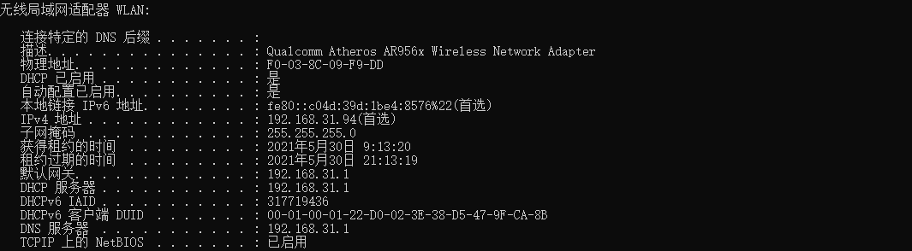

# 一个IP地址背后的信息

参考资料：

​	《TCP/IP详解 卷1：协议》

## 0x00 什么是IP？

IP，全称Internet Protocol，中文名网际互连协议

## 0x01 什么是IP地址？

在Windows系统打开命令行执行**ipconfig /all**命令查看当前计算机的IP地址以及其他相关详细信息，如果你的计算机是直接插网线，那么请查看以太网适配器，如果是和我一样连接WiFi，则查看无线局域网适配器



能够看到有一个IPv4地址**192.168.31.94**，当然还有一个IPv6地址，是的没错，IP地址分为两大类，IPv4是目前使用最广泛的，而IPv6的出现是为了解决IPv4地址不够的问题，这个待会再说

当然还有其他设备连接着同一个WiFi，顺便查看一下它们的IP地址，手机的IPv4地址是**192.168.31.52**，平板的IPv4地址是**192.168.31.70**，很明显可以看出来它们的IP地址在第三个点之前完全相同，区别就在于最后的这一部分，展开讲之前先回顾一下IP地址的表示方法，例如上面这几种称为点分十进制表示法也叫做点分四组，由三个点分隔而成的四组范围均在[0,255]的整数组成，这种十进制表示方法是为了我们日常显示和使用方便，在计算机通信时，便需要在底层将十进制转化为32位的二进制表示

```markdown
#示例
点分十进制:192.168.31.94
二进制:11000000 10101000 00011111 1011110
```


