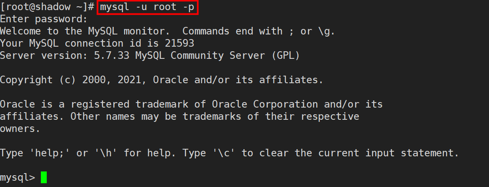
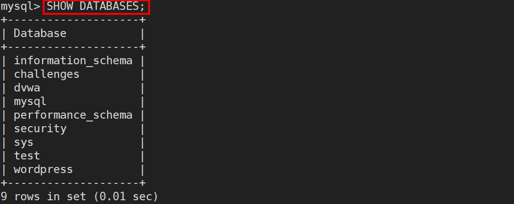
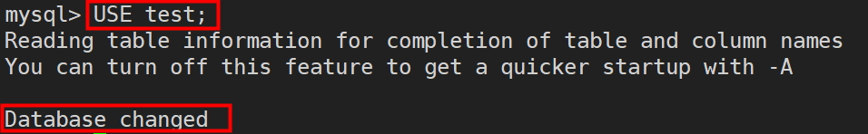
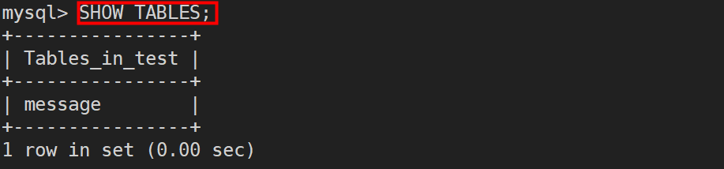
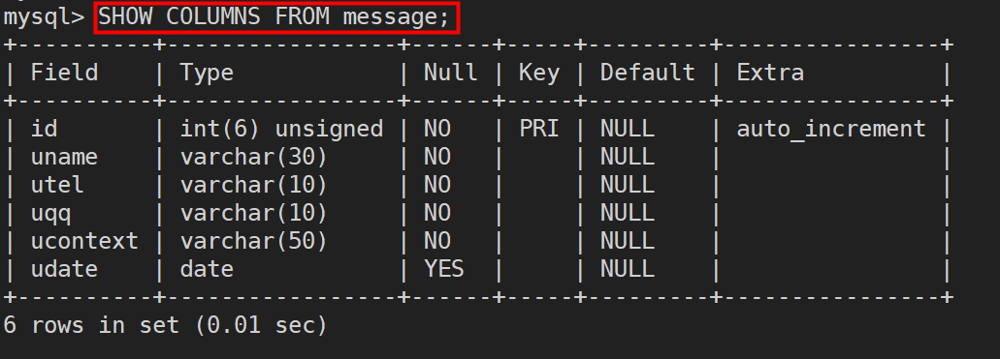
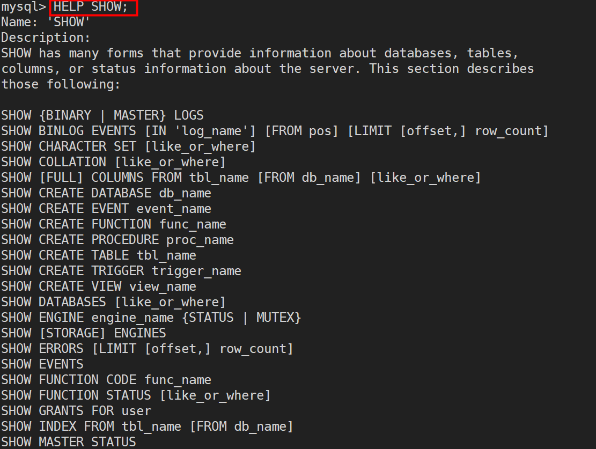
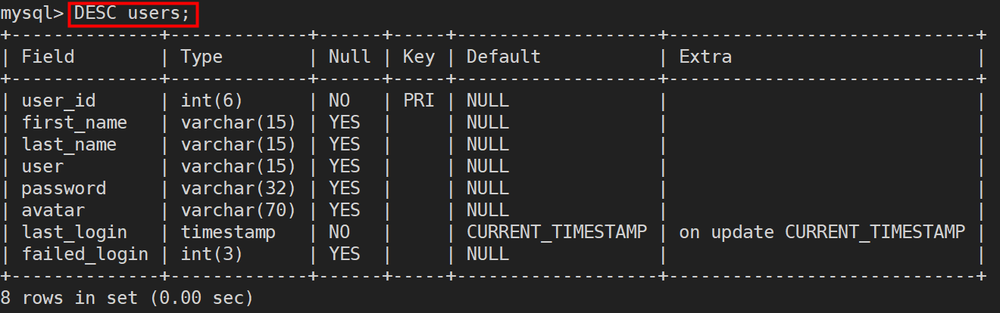
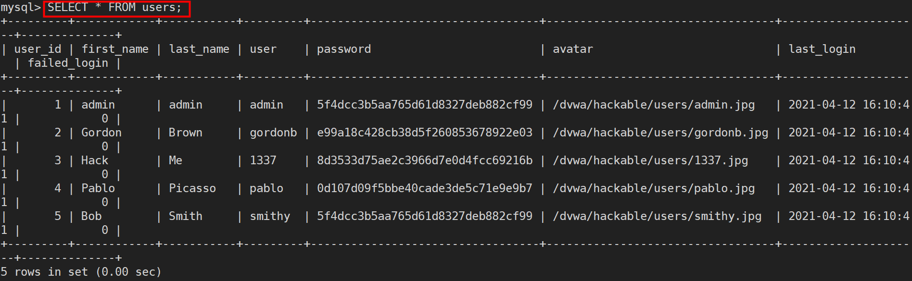
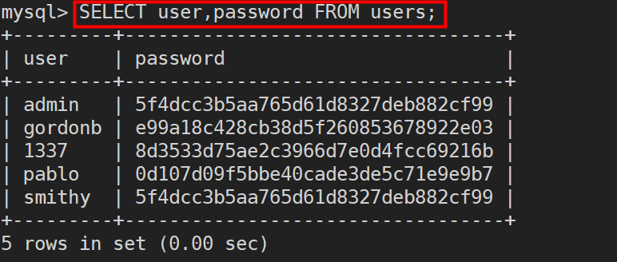

# MySQL学习笔记

# 0x00 数据库和SQL基础

学习MySQL必须先要知道什么是数据库，就拿GitHub来说，也就是目前存储该篇笔记的地方，我在这里创建了一个项目Cyberspace-Security-Note就是一个数据库，它负责存储我学习关于网络安全的所有笔记，当然也可以说它是一个容器

**数据库（database）保存有组织的数据的容器（通常是一个文件或一组文件）**

那什么又是SQL呢？先来看一下全称，Structured Query Language，结构化查询语言，既然是语言，那么就像是其他大部分语言一样，有它的关键字，语法等等，以及它主要是用于做什么，就像HTML，CSS，JavaScript用来做网站的前端，PHP，JAVA等通常用于后端，SQL则是用于和数据库交互通信

# 0X01 MySQL简介

MySQL是DBMS（数据库管理系统）的一种，属于数据库软件，负责对所有存储的数据检索、管理和处理，DBMS分为两类，一类是基于文件共享系统的DBMS，另一类是基于客户机-服务器的DBMS，而现在所学习的MySQL正是属于第二类的数据库，客户机-服务器应用分为两个不同的部分，安装在服务器端的部分是负责所有数据访问和处理的一个软件，该软件运行在称为数据库服务器的计算机上，也就是说与数据文件打交道的只有服务器端的软件，客户机是与用户打交道的软件，用户使用客户机软件对数据发起请求或更改，客户机软件通过网络将用户的请求或更改发送给服务器软件，服务器软件根据用户的请求来处理数据，完成后将结果返回给客户机软件

在后续学习MySQL中，使用的服务器软件便是MySQL DBMS，而使用的客户机软件则主要是由MySQL提供的mysql命令行程序，并且客户机和服务器软件安装在同一台远程VPS上

当然基于客户机-服务器的数据库不只是MySQL，还包括Oracle，Microsoft SQL Server等，客户机也可以是脚本语言（Perl），Web应用开发语言（如ASP、JSP和PHP），程序设计语言（C、C++、Java）等

# 0x02 使用MySQL

使用数据库查询数据、处理数据首先第一步要做的是连接到数据库，需要提供哪些信息呢？想想我们使用其他软件时一般会需要我们输入哪些信息，无非就是用户名和密码，MySQL也是这样

```mysql
mysql -u root -p 123
```



对参数做个简单解释

-u后跟登录MySQL所使用的账户名，这里我们使用的是root用户，具有对数据库的完全权限，在实际生产中可能是一个仅对部分数据库有操作权限的普通账户

-p后可以直接跟用户名所对应的密码，也可以回车后等待数据库提示输入密码时再输入，好处是此时的密码是不显示的，提升了一定的安全性

这样我们就连接和登录上了数据库

这时候页面仅有一个和Linux系统一样的shell交互行，并无什么数据库信息，这里先来介绍第一个关键字**USE**，当我们要选择一个数据库时便使用该关键字，USE后跟数据库名称即可打开这个数据库，但如果是个新手或是第一次使用MySQL的人，显然他不会知道有哪些数据库，更不要说名称，这时候就需要新关键字**SHOW**，显示信息便使用的是该关键字，那么显示所有数据库使用的是哪条命令呢？

```mysql
SHOW DATABASES;
```



可以看到返回了9条记录，分别是当前MySQL管理的9个数据库的名称，比如现在想要要对test库做操作

```mysql
USE test;
```



显示消息提示数据库改变，就意味着这条命令执行成功，现在就可以读取test库中的数据

数据并不是揉成一团放在库中，就像在GitHub上的项目一般，它会分不同的文件夹，会对不同的知识分门别类的存储，数据库也一样，它是按照数据库管理员对不同数据的规划而存储在不同的表中，比如某电子商城它的数据库里，users表专门负责存储用户的用户名信息等，它与专门存储商品信息的表不会混在一张表中

所以现在即使我们选择了test的库，仍然无法直接访问数据，先要知道库里面有哪些表，那么与之前相同的情况又发生了，我们并不知道有哪些表名，同理使用SHOW，既然是显示所有表的信息

```mysql
SHOW TABLES;
```



看到有一张叫message的表，就像Excel表格一般，表会有它的每一列的字段名称，每一列的数据类型等，想要查看这些信息都可以使用SHOW来做到

```mysql
SHOW COLUMNS FROM message;
```



使用**FROM**关键字后跟表名来指定要显示的是哪张表的列信息，因为实际情况里肯定不会仅有message这一张表存储在test库中，当然像**DATABASES**、**TABLES**、**COLUMNS**三个也都是关键字

还可以通过**DESCRIBE**关键字来快捷查看表的列信息等，也可以使用它的简写**DESC**来代替，作用与SHOW COLUMNS FROM相同

```mysql
DESCRIBE message;
DESC message;
```

ok，说完这些基础概念，现在来分析一下数据库返回的这张表里的信息，包含表头的6列字段以及表内的6行信息，可以看到这个message表里面存储的每一行信息都具备id、uname、utel、uqq、ucontext、udate这6个信息，也可以说是这6个信息构成了message表内的一条数据

当然SHOW的用法不止于此，不仅SHOW还包括前面介绍的关键字和尚未学习的关键字都可以通过**HELP**关键字了解更多帮助信息



# 0x03 检索数据

对数据操作，绕不开检索数据，大型的电商数据库可能单是关于服装的数据库数据就有几十亿条，如何从表中检索出一个或多个数据呢？使用**SELECT**关键字，当然也可以说是**SELECT语句**，构建一条基本的SELECT语句至少包括两个信息，想选择什么和从哪里选择

上节说到一条数据是由好几列字段组成，我们想要检索数据，可以有选择的看它的部分列，也可以是全部列

演示时所选的数据库是学习SQL注入时用到的sqli-labs靶场所创建的数据库challenges，包含guestbook和users两张表，我们演示使用的就是users表

首先使用**DESC users**查看表的信息

```mysql
DESC users;
```



可以了解到该表内存储的每一条数据都是由这八个字段内容组成

当我们想要看到表的全部信息，也就是说表中的每一列都要检索出来，我们会使用到**通配符***，这样做的好处是当我们不知道表内有哪些列时，它可以帮我们全部检索出来，缺点便是会降低检索和应用程序的性能

```mysql
SELECT * FROM users;
```



因为演示所使用的表只有5条数据，所以并不会有直观的性能差异感受

而且实际上我们检索数据时也并非需要一条数据的全部字段内容，就像我们目前使用的这张users表来说，我们真正关心的是由它的用户名和密码，我们就可以仅仅检索这两个列

```mysql
SELECT user,password FROM users;
//也可以检索单个列
SELECT user FROM users;
```



得到的数据简单明了，易于查看，需要注意的是多个列名之间需要用逗号隔开


**参考书籍**

​	**《MYSQL必知必会》**

