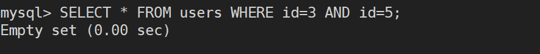

# MySQL学习笔记

# 0x00 数据库和SQL基础

学习MySQL必须先要知道什么是数据库，就拿GitHub来说，也就是目前存储该篇笔记的地方，我在这里创建了一个项目Cyberspace-Security-Note就是一个数据库，它负责存储我学习关于网络安全的所有笔记，当然也可以说它是一个容器

**数据库（database）保存有组织的数据的容器（通常是一个文件或一组文件）**

那什么又是SQL呢？先来看一下全称，Structured Query Language，结构化查询语言，既然是语言，那么就像是其他大部分语言一样，有它的关键字，语法等等，以及它主要是用于做什么，就像HTML，CSS，JavaScript用来做网站的前端，PHP，JAVA等通常用于后端，SQL则是用于和数据库交互通信

# 0X01 MySQL简介

MySQL是DBMS（数据库管理系统）的一种，属于数据库软件，负责对所有存储的数据检索、管理和处理，DBMS分为两类，一类是基于文件共享系统的DBMS，另一类是基于客户机-服务器的DBMS，而现在所学习的MySQL正是属于第二类的数据库，客户机-服务器应用分为两个不同的部分，安装在服务器端的部分是负责所有数据访问和处理的一个软件，该软件运行在称为数据库服务器的计算机上，也就是说与数据文件打交道的只有服务器端的软件，客户机是与用户打交道的软件，用户使用客户机软件对数据发起请求或更改，客户机软件通过网络将用户的请求或更改发送给服务器软件，服务器软件根据用户的请求来处理数据，完成后将结果返回给客户机软件

在后续学习MySQL中，使用的服务器软件便是MySQL DBMS，而使用的客户机软件则主要是由MySQL提供的mysql命令行程序，并且客户机和服务器软件安装在同一台远程VPS上

当然基于客户机-服务器的数据库不只是MySQL，还包括Oracle，Microsoft SQL Server等，客户机也可以是脚本语言（Perl），Web应用开发语言（如ASP、JSP和PHP），程序设计语言（C、C++、Java）等

# 0x02 使用MySQL

使用数据库查询数据、处理数据首先第一步要做的是连接到数据库，需要提供哪些信息呢？想想我们使用其他软件时一般会需要我们输入哪些信息，无非就是用户名和密码，MySQL也是这样

```mysql
mysql -u root -p 123
```


对参数做个简单解释

-u后跟登录MySQL所使用的账户名，这里我们使用的是root用户，具有对数据库的完全权限，在实际生产中可能是一个仅对部分数据库有操作权限的普通账户

-p后可以直接跟用户名所对应的密码，也可以回车后等待数据库提示输入密码时再输入，好处是此时的密码是不显示的，提升了一定的安全性

这样我们就连接和登录上了数据库

这时候页面仅有一个和Linux系统一样的shell交互行，并无什么数据库信息，这里先来介绍第一个关键字**USE**，当我们要选择一个数据库时便使用该关键字，USE后跟数据库名称即可打开这个数据库，但如果是个新手或是第一次使用MySQL的人，显然他不会知道有哪些数据库，更不要说名称，这时候就需要新关键字**SHOW**，显示信息便使用的是该关键字，那么显示所有数据库使用的是哪条命令呢？

```mysql
SHOW DATABASES;
```


可以看到返回了9条记录，分别是当前MySQL管理的9个数据库的名称，比如现在想要要对test库做操作

```mysql
USE test;
```


显示消息提示数据库改变，就意味着这条命令执行成功，现在就可以读取test库中的数据

数据并不是揉成一团放在库中，就像在GitHub上的项目一般，它会分不同的文件夹，会对不同的知识分门别类的存储，数据库也一样，它是按照数据库管理员对不同数据的规划而存储在不同的表中，比如某电子商城它的数据库里，users表专门负责存储用户的用户名信息等，它与专门存储商品信息的表不会混在一张表中

所以现在即使我们选择了test的库，仍然无法直接访问数据，先要知道库里面有哪些表，那么与之前相同的情况又发生了，我们并不知道有哪些表名，同理使用SHOW，既然是显示所有表的信息

```mysql
SHOW TABLES;
```


看到有一张叫message的表，就像Excel表格一般，表会有它的每一列的字段名称，每一列的数据类型等，想要查看这些信息都可以使用SHOW来做到

```mysql
SHOW COLUMNS FROM message;
```


使用**FROM**关键字后跟表名来指定要显示的是哪张表的列信息，因为实际情况里肯定不会仅有message这一张表存储在test库中，当然像**DATABASES**、**TABLES**、**COLUMNS**三个也都是关键字

还可以通过**DESCRIBE**关键字来快捷查看表的列信息等，也可以使用它的简写**DESC**来代替，作用与SHOW COLUMNS FROM相同

```mysql
DESCRIBE message;
DESC message;
```

ok，说完这些基础概念，现在来分析一下数据库返回的这张表里的信息，包含表头的6列字段以及表内的6行信息，可以看到这个message表里面存储的每一行信息都具备id、uname、utel、uqq、ucontext、udate这6个信息，也可以说是这6个信息构成了message表内的一条数据

当然SHOW的用法不止于此，不仅SHOW还包括前面介绍的关键字和尚未学习的关键字都可以通过**HELP**关键字了解更多帮助信息


# 0x03 检索数据

对数据操作，绕不开检索数据，大型的电商数据库可能单是关于服装的数据库数据就有几十亿条，如何从表中检索出一个或多个数据呢？使用**SELECT**关键字，当然也可以说是**SELECT语句**，构建一条基本的SELECT语句至少包括两个信息，想选择什么和从哪里选择

上节说到一条数据是由好几列字段组成，我们想要检索数据，可以有选择的看它的部分列，也可以是全部列

首先使用**DESC users**查看表的信息

```mysql
DESC users;
```


可以了解到该表内存储的每一条数据都是由这八个字段内容组成

当我们想要看到表的全部信息，也就是说表中的每一列都要检索出来，我们会使用到**通配符***，这样做的好处是当我们不知道表内有哪些列时，它可以帮我们全部检索出来，缺点便是会降低检索和应用程序的性能

```mysql
SELECT * FROM users;
```


因为演示所使用的表只有5条数据，所以并不会有直观的性能差异感受

而且实际上我们检索数据时也并非需要一条数据的全部字段内容，就像我们目前使用的这张users表来说，我们真正关心的是由它的用户名和密码，我们就可以仅仅检索这两个列

```mysql
SELECT user,password FROM users;
//也可以检索单个列
SELECT user FROM users;
```


得到的数据简单明了，易于查看，需要注意的是查询多个列名之间需要用逗号隔开

检索数据时经常会用到的两个关键字**LIMIT**和**DISTINCT**，LIMIT用于限制返回的结果，可以实现返回第1行或是前几行，还可以是从某行开始后的几行，现在有一张表的数据时这样的


（对图片做两点说明，一SQL语句不区分大小写，许多开发人员喜欢对SQL关键字使用大写；二多条SQL语句必须添加分号隔开，多数DBMS不需要在单条SQL语句后添加分号，但这是一个好习惯）

情况1：只想检索第1行数据

```mysql
SELECT * FROM users LIMIT 1;
//检索出前5行数据
SELECT * FROM users LIMIT 5;
```


情况2：从第2行开始的5行数据

```mysql
SELECT * FROM users LIMIT 2,5;
```


这时候会发现检索出id值直接从3开始的5行数据，直接跳过了第二条数据，这是为什么呢？如果之前有学过计算机编程语言或是了解过操作系统等知识就会知道，在计算机中大部分情况0代表开始，也就是说**LIMIT2,5**这条语句实际上的2是排在0，1，2中的第三位，所以检索出的数据也会从第3条开始，所以正确的检索语句如下

```mysql
SELECT * FROM users LIMIT 1,5;
//替代语法
SELECT * FROM users LIMIT 5 OFFSET 1;
```


DISTINCT关键字用起来比较简单，本身单词的意思便是不同的，也就是说该关键字用于返回不同的值，当使用SELECT返回的结果有大量重复时，使用DISTINCT能够帮助我们只返回不同的结果，比如想要查询某张学生表中，有多少不同的年级时便可以使用该关键字来过滤掉重复的结果

```mysql
SELECT DISTINCT grade FROM students;
```

需要注意的是如果存在多个列名，DISTINCT作用的是全部的列名而仅仅是前置它的列，除非指定的两个列都不同，否则所有行都将被检索出来

不知道有没有听过FQDN，Full Qualified Domain Name，完全限定域名的概念，它指的是互联网上计算机或主机的完整域名，当运用于MySQL中便是完全限定表名，完全限定列名，有一些情形需要使用完全限定名，这里先有个印象，以后遇到时能够了解

```mysql
//示例，本节开始的sql语句
SELECT user FROM users;
//改写为使用完全限定名的sql语句
SELECT users.user FROM security.users;
```

# 0x04 排序检索数据

在学习关键字SELECT关键字时提到了SELECT语句这个概念，由一个或多个子句组成一条SELECT语句，FROM子句就是一个例子，当然宏观上来说SQL语句就是由子句组成，有些子句是必须的，有些则是可选的

本节所介绍的排序关键字**ORDER BY**也属于是子句，它可以取一个或多个列名字，依照列来多数据进行排序，举个例子就是班级公布成绩时有多种方式，可能是按照学号排序依次公布，也可以是按照分数高低公布

不能否认有时我们确实会有这样的需求

比如当前表里的数据如下

```mysql
SELECT id,username FROM users;
```


显然默认是按照id值的升序来显示数据，如果我们想按照username里的字母顺序来排序就需要使用ORDER BY关键字

```mysql
SELECT id,username FROM users ORDER BY username;
```


ORDER BY后的列不需要一定是显示列中的列，比如该表还有password字段，即使不显示也可以按照password来排序

刚才也说到ORDER BY可以按多个列排序，列名之间用逗号隔开就好，那么当涉及多个列排序时是按照什么规则呢，它会先以第一个列排序，再以第二个列排序，以此类推

那么我们如果先让数据按照username排序，再按照id排序那么最终的结果会是怎样？

```mysql
SELECT id,username FROM users ORDER BY username,id;
```


可以发现，结果并没有发生变化，这是为什么呢？因为username内的值都是唯一的所以直接就按照username排序，不会涉及到id排序，也就是说，只有当username中有重名存在时，才会将重名的数据按照id再次排序

那么第二个问题，如何实现从大到小排序？

使用关键字**DESC**，该关键字只会应用到位于其前面的列，所以如果想要实现多列上的降序，就需要添加多个DESC，与DESC相对的是升序关键字**ASC**，但实际并用不到，因为默认就是按照升序

演示按照id降序检索数据

```mysql
SELECT id,username FROM users ORDER BY id DESC;
```


本节开始便提到子句的概念，有些子句是必须的，有些子句是可选的，SQL语句是由多个子句构成，所以我们可以结合LIMIT实现检索出数据中最大或最小的值，这里演示找到id值最大的用户

```mysql
SELECT id,username FROM users ORDER BY id DESC LIMIT 1;
```


# 0x05 过滤数据

**该部分笔记内容包含《MySQL必知必会》第六章、第七章以及第八章的知识点，之后会直接先学习MySQL的增删改查操作，后续会再补充**

说起过滤数据，在之前的章节里说个一个关键字**DISTINCT**，能够过滤掉结果中重复的数据，而本节所说的过滤数据是在指定搜索条件的基础下过滤掉不需要的数据，着需要使用SELECT语句的另一个子句**WHERE**关键字，之所以需要过滤数据，是因为实际情况下数据库表中存有海量的数据，很少需要检索出表中的所有行，通常会根据实际需求来提取出表数据的子集，只检索所需数据需要指定搜索条件，因此搜索条件也称为过滤条件

WHERE子句在FROM子句后，而如果同时使用OREDER BY，则需要让ORDER BY位于WHERE之后，否则会产生错误

依旧使用下面这张表来演示


情况1：查找username等于admin的数据

```mysql
SELECT * FROM users WHERE username='admin';
```


情况2：查找id等于5的数据

```mysql
SELECT * FROM users WHERE id=5;
```


情况3：查找id在5到10之间的数据

```mysql
SELECT * FROM users WHERE id BETWEEN 5 AND 10;
```


三个示例sql语句中出现了等于号**=**和**BETWEEN**，这都是WHERE子句操作符，类似的还有**<>**,**!=**,**<**,**>**,**<=**,**>=**，这与编程语言中用于判断的操作符相同，需要注意的是<>也表示不等于

比较特殊的BETWEEN，按照单词本身意思我们需要提供一个区间，使用**AND**操作符来连接区间范围的最小值和最大值，当然不止是BETWEEN可以使用AND来连接，操作符都可以使用AND来组合，例如可以使用<=组合>=来实现情况3的相同操作，每添加一条过滤条件就需要多用一个AND，添加的过滤条件越多，数据就越精确

```mysql
SELECT * FROM users WHERE id >= 5 AND id <=10;
```


前两条sql语句有一处不同是在搜索条件处，username的值用了单引号括起来，而id的值则不需要，这是因为username的数据类型为字符串varchar型，而id的类型为数值int型，关于数据类型放到后面再说，但这其实和学习编程语言最先了解的数据类型其实是相似的，可以使用DESC查看列详情查看到每一列的数据类型，这是在创建该表时规定的，当然也可以后续更改某列的数据类型

```mysql
DESC users;
```


提到创建表时设定列的数据类型就要说到一种特殊的数据类型**NULL**，代表无值，no value的意思，既不是指它为0，也不是说它是空字符串，是指被设定为NULL的列可以不包含值

SELECT语句里有一个特殊子句**IS NULL**用来检查具有NULL值的列，也就是包含具有空值的列

```mysql
SELECT * FROM users WHERE id IS NULL;
```

由于表中没有这样的值，所以没有回显数据

AND也是操作符，但它其实还有另一个名称那就是**逻辑操作符**，不仅用来联结WHERE搜索条件，还可以改变WHERE子句中多个子句之间的关系，逻辑操作符还包括**OR**

正如数学中AND和OR的关系一般，在sql中也是与和或的关系，AND操作符想要检索出数据首先要保证AND两侧的子句能够同时匹配，而OR只需要保证两侧子句任意匹配一个

为了直观的显示AND和OR的差别，请看情况4

情况4：查找id=3和id=5的数据

```mysql
SELECT * FROM users WHERE id=3 AND id=5;
```



无返回数据，很明显如果要同时满足id等于3和5这样的数据是不存在的

```mysql
SELECT * FROM users WHERE id=3 OR id=5;
```


而只需要把AND换成OR，就可以检索出id等于3和id等于5的值，也就是说OR会分别去匹配id=3和id=5，而不是像AND一样同时匹配

正如数学里1 and 0为假，1 or 0为真一样，sql语句也是如此

WHERE子句中可以包括任意数目的AND和OR操作符，可以结合使用两者来进行更复杂更高级的过滤，但此时就像小学掌握了加减乘除后需要考虑一个计算顺序的问题，也就是编程中提到的优先级问题，解决方法和解决加减乘除计算顺序的方法如出一辙，添加括号，这是一个好习惯，虽然的确存在运算优先级，但并不要过分依赖默认的计算优先顺序，使用圆括号能够消除歧义

**运算优先级：圆括号 > AND > OR**

圆括号不仅能够干这些，还可以配合**IN**操作符来实现和OR相同的功能

依旧是情况4，使用IN

```mysql
SELECT * FROM users WHERE id IN (3,5);
```


IN操作符来指定条件范围，范围中的每个条件都可以进行匹配，IN取的合法值在圆括号内由逗号分隔组成，既然IN和OR实现的功能类似，那么使用IN还是OR？

答案是使用IN，原因有四点

1. IN操作符语法更加清楚和直观
2. 使用IN，计算时的顺序更容易管理
3. IN操作符一般比OR执行快
4. 能够动态的建立WHERE子句，后续章节详细介绍

WHERE子句中还有一个**NOT**操作符，有且只有一个功能就是取反，在MySQL中可以对IN，BETWEEN，EXISTS子句取反

情况5：查找除了id等于3和5的所有数据

```mysql
SELECT * FROM users WHERE id NOT IN (3,5);
```


除了以上过滤数据的方法还可以使用通配符进行过滤，介绍2个通配符，分别是百分号**%**，下划线**_**

通配符是可以用来匹配值的一部分的特殊字符，在正则表达式中也有运用，使用通配符必须使用**LIKE**操作符，LIKE指示MySQL后跟的搜索模式利用通配符匹配而不是直接相等匹配进行比较

百分号%表示任何字符出现任意次数，而下划线_只匹配单个字符，需要注意通配符不能匹配NULL

情况1：检索username以a开头的数据

```mysql
SELECT * FROM users WHERE username LIKE 'a%';
```


根据MySQL配置方式，也可以使搜索区分大小写

情况2：检索username以1结尾的数据

```mysql
SELECT * FROM users WHERE username LIKE '%1';
```


情况3：检索username中包含min的数据

```mysql
SELECT * FROM users WHERE username LIKE '%min%';
```


情况4：使用下划线_检索username中开头是admin的数据

```mysql
SELECT * FROM users WHERE username LIKE 'admin_';
```


可以看到少了一个admin的用户，是因为下划线_与百分号%能够匹配0个字符不一样，它总是匹配一个字符，不能多也不能少

需要注意尾空格可能会干扰到通配符匹配，可以使用函数去掉首尾空格，后续介绍

使用通配符时要注意两点

1. 不要过度使用通配符，因为这会使得搜索花费更多的时间
2. 除非绝对有必要，否则不要把通配符用在搜索模式的开始处，因为这样是最慢的

截至这里，学习了数据库增删改查四种基础操作中的查找操作

# 0x06 插入数据


# 0x07 更新和删除数据


# 0x08 创建和操纵表


# 0x09 


# 0xA


**参考书籍**

​	**《MYSQL必知必会》**

