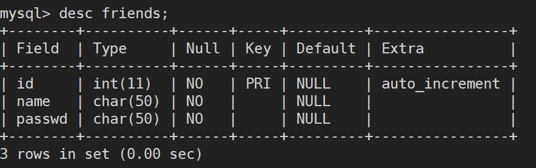
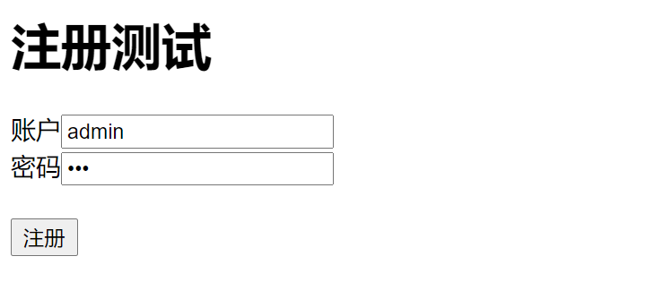
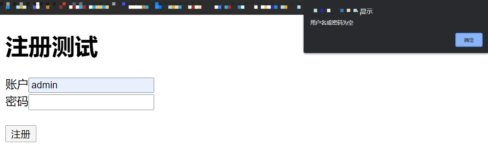
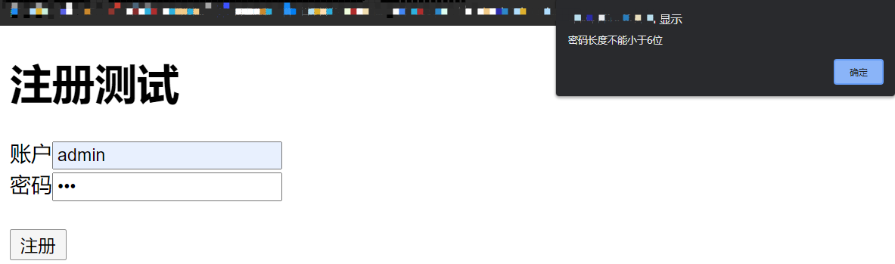

# SQL注入漏洞

之前对于SQL注入漏洞大部分是直接使用DVWA环境本身搭建好的漏洞环境来学习，今天想要从零搭建一个SQL注入漏洞的环境，直观的了解SQL注入漏洞产生的原因、特征以及防御方法

## 0x00 漏洞环境概述

**前提：搭建好LNMP或LAMP环境，我使用的是Nginx**

想先搭建一个比较简单的环境，比如在网站实现用户注册的功能，需要提供用户自定义的用户名和密码，需要判断该用户名是否存在，如果已经存在则提示用户尝试别的用户名，而且要考虑到账户的安全性，要求密码不能为空，长度最少是6位，用户名和密码符合规则后才可以存入数据库，并且返回创建用户成功的消息

搭建漏洞环境用到的相关知识

​	MYSQL

## 0x01 漏洞环境搭建-创建数据库

既然是SQL注入漏洞，一定是与数据库有交互的地方才会产生该漏洞，所以第一步首先在MySQL中创建一张存储网站所有用户账户名和密码的friends表

## 0x02 漏断环境搭建-注册功能

创建好了数据库，接下来才是重点，需要使用HTML编写具有注册功能的页面，使用JavaScript在浏览器端对用户输入的账户和密码进行检查，对于不合规的注册信息直接返回错误，不将请求发送给服务器，对于合规的注册信息发送给服务器审核，确保账户是唯一后存入数据库

看起来实现注册功能似乎很复杂，让我们分解问题，一步步来解决

首先用HTML完成它能够干的事，创建一个让用户填写账户和密码的表单并能提交给服务器中处理该请求的register.php文件

接着就轮到JavaScript出马了，在浏览器端对账户密码做初步的审核，实现两个功能，一是对于输入空账户或空密码的报错，二是对密码长度小于6位报错

ok，JavaScript能干的事也完成的差不多了，最后轮到PHP了，在用户点击注册提交数据之后，浏览器会把表单信息传递给服务器端register.php脚本来处理，这部分脚本需要做什么呢？需要拿着用户输入的账户去数据库friends表中比对是否早已经存在，如果存在则返回给客户端账户已经被注册的消息，让用户换一个账户，如果不存在则将用户的账户密码信息存入表中并返回注册成功的消息，但做这些的前提是先用PHP连接MySQL，能够对数据库执行sql语句，所以该脚本共需要完成这么三件事即可

